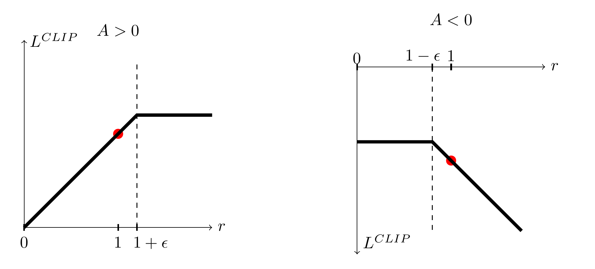
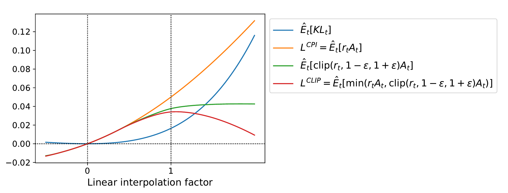

# PPO — résumé du papier

> Schulman, Wolski, Dhariwal, Radford, Klimov (OpenAI), *Proximal Policy Optimization **Algorithms***, arXiv:1707.06347, 2017.

Le papier propose **une nouvelle famille de méthodes de gradient de politique**. Pour comprendre ce qu'elle apporte, il faut d'abord comprendre la famille qu'elle remplace — TRPO — et ce qui y coûtait cher.

**Conventions de notation de cette page** : $`\delta`$ = rayon de la région de confiance KL (TRPO, $`\delta = 0{,}01`$ dans tout le papier TRPO) ; $`\epsilon`$ = paramètre de clipping (PPO, $`\epsilon = 0{,}2`$). La [fiche de cours](fiche-policy-gradient.md) note les deux $`\epsilon`$ en le signalant ; ici on les sépare, ils n'ont rien à voir.

---

## 1. Ce que TRPO résolvait, et à quel prix

### 1.1 Le problème de départ

L'estimateur de gradient de politique s'écrit

```math
\hat{g} = \hat{\mathbb{E}}_t\big[\nabla_\theta \log \pi_\theta(a_t \mid s_t)\,\hat{A}_t\big] \tag{1}
```

et s'obtient en différentiant la « perte »

```math
L^{PG}(\theta) = \hat{\mathbb{E}}_t\big[\log \pi_\theta(a_t \mid s_t)\,\hat{A}_t\big] \tag{2}
```

> **En clair.** $`L^{PG}`$ n'est pas une quantité qui *veut dire* quelque chose. C'est un objet dont la dérivée redonne $`\hat g`$ — un prétexte à autodiff. C'est précisément ce que dit le papier : il est tentant de faire plusieurs pas d'optimisation sur $`L^{PG}`$ avec la même trajectoire, mais ce n'est **pas justifié** et cela produit empiriquement *« des mises à jour de politique destructivement grandes »*.

D'où la question : comment réutiliser un lot de données sur plusieurs pas sans exploser ?

### 1.2 L'avantage de substitution

On veut évaluer $`\pi_\theta`$ avec des données produites par $`\pi_{\theta_{old}}`$. Échantillonnage préférentiel :

```math
\mathbb{E}_{a \sim \pi_\theta}[X] = \mathbb{E}_{a \sim \pi_{\theta_{old}}}\!\left[\frac{\pi_\theta(a \mid s)}{\pi_{\theta_{old}}(a \mid s)}\,X\right]
```

d'où le **ratio de probabilité** — aussi appelé ratio de vraisemblance, techniquement un ratio d'importance :

```math
r_t(\theta) = \frac{\pi_\theta(a_t \mid s_t)}{\pi_{\theta_{old}}(a_t \mid s_t)}, \qquad r_t(\theta_{old}) = 1
```

et l'**avantage de substitution** (*surrogate advantage*), que le papier note $`L^{CPI}`$ — CPI pour *conservative policy iteration*, l'algorithme de Kakade & Langford (2002) d'où il vient :

```math
L^{CPI}(\theta) = \hat{\mathbb{E}}_t\!\left[\frac{\pi_\theta(a_t \mid s_t)}{\pi_{\theta_{old}}(a_t \mid s_t)}\hat{A}_t\right] = \hat{\mathbb{E}}_t\big[r_t(\theta)\hat{A}_t\big] \tag{6}
```

**Où est passé $`\hat g`$ ?** En $`\theta = \theta_{old}`$, le ratio se simplifie et

```math
\nabla_\theta L^{CPI}(\theta)\Big|_{\theta = \theta_{old}} = \hat{\mathbb{E}}_t\big[\nabla_\theta \log \pi_{\theta_{old}}(a_t \mid s_t)\hat{A}_t\big] = \hat{g}
```

C'est **le même gradient que $`L^{PG}`$ au point de départ**. Mais contrairement à $`L^{PG}`$, $`L^{CPI}`$ garde un sens quand on s'éloigne : le ratio suit le déplacement de la politique. C'est ce qui autorise à substituer (2) par (6) — et donc à faire plusieurs pas.

Le mot *substitut* reste mérité : le ratio corrige le changement de loi **pour les actions**, pas pour la distribution d'états, qui reste celle de $`\pi_{\theta_{old}}`$. L'approximation est là.

### 1.3 Le programme TRPO

Maximiser $`L^{CPI}`$ sans garde-fou donne une mise à jour excessivement grande. TRPO pose donc une **contrainte dure** :

```math
\begin{cases}
\displaystyle\max_{\theta}\; \hat{\mathbb{E}}_t\big[r_t(\theta)\hat{A}_t\big]\\[6pt]
\text{sous } \; \hat{\mathbb{E}}_t\big[\mathrm{KL}[\pi_{\theta_{old}}(\cdot \mid s_t),\ \pi_\theta(\cdot \mid s_t)]\big] \le \delta
\end{cases} \tag{3-4}
```

Résolu par développement de Taylor autour de $`\theta_{old}`$ : l'objectif linéarisé $`g^{T}(\theta - \theta_{old})`$, la contrainte approchée **au second ordre** $`\tfrac12 (\theta-\theta_{old})^{T} F (\theta - \theta_{old})`$, où $`F`$ — la hessienne de la KL — **est** la matrice d'information de Fisher. Le pas optimal de ce programme quadratique vaut $`\sqrt{2\delta / (g^{T}F^{-1}g)}\; F^{-1}g`$.

### 1.4 Les deux astuces de calcul

**Gradient conjugué.** On ne forme ni ne stocke $`F`$ ($`N^2`$ cases pour $`N \sim 10^5`$ paramètres), encore moins $`F^{-1}`$. On résout

```math
F x = g
```

par gradient conjugué, qui ne demande que des **produits matrice-vecteur** $`Fv`$ — eux-mêmes obtenus par produit hessien-vecteur en différentiation automatique, sans jamais matérialiser $`F`$. Une dizaine d'itérations suffit.

**Recherche linéaire par rebroussement.** L'approximation quadratique peut mentir. On calcule donc le pas, puis on le **teste avant de l'appliquer** : $`\alpha^{j}`$ fois le pas plein, pour $`j = 0, 1, 2, \dots`$, jusqu'à ce que les **deux** conditions tiennent —

1. KL **exacte** (pas via Fisher) $`\le \delta`$ ;
2. amélioration réelle du substitut : $`L^{CPI}(\theta_{new}) \ge L^{CPI}(\theta_{old})`$.

L'annexe C du papier TRPO est explicite : sans cette recherche linéaire, *« l'algorithme calcule occasionnellement de grands pas qui provoquent une dégradation catastrophique des performances »*.

### 1.5 Ce que ça coûte

| Coût | Détail |
|---|---|
| Calcul | gradient conjugué + produits hessien-vecteur **à chaque mise à jour** |
| Calcul | recherche linéaire : jusqu'à ~10 évaluations complètes de la KL par pas |
| Architecture | **dropout interdit** |
| Architecture | **partage de paramètres acteur/critique interdit** (et tâches auxiliaires) |
| Ingénierie | implémentation lourde et délicate |

C'est l'introduction du papier PPO qui pose les deux interdits : TRPO *« n'est pas compatible avec les architectures qui incluent du bruit (comme le dropout) ou du partage de paramètres (entre la politique et la fonction de valeur, ou avec des tâches auxiliaires) »*. Le papier l'affirme sans le démontrer ; voici la lecture standard.

> **En clair — pourquoi le dropout casse TRPO.** TRPO exige que $`\pi_\theta`$ soit une fonction **déterministe** de $`\theta`$. Avec dropout, deux passes avant sur le *même* $`\theta`$ tirent deux masques différents, donc deux distributions différentes. La KL réévaluée dans la recherche linéaire mélange alors le vrai déplacement de paramètres et le bruit de masque : le test « KL ≤ δ ? » ne mesure plus ce qu'il prétend mesurer. Et le produit $`Fv`$ devient un estimateur bruité de l'opérateur que le gradient conjugué doit inverser — CG sur un opérateur bruité perd sa convergence.

> **En clair — pourquoi le partage de paramètres casse TRPO.** Le programme (3-4) ne contraint **que la politique** : $`F`$ est la hessienne de la KL de la *sortie politique*, définie sur les seuls paramètres de politique. Si le tronc est partagé avec le critique, la perte de valeur doit descendre sur ces mêmes paramètres — mais elle n'a aucune place dans « max $`L^{CPI}`$ sous KL ≤ δ », et sa direction de descente n'est mesurée par aucune métrique KL. En pratique il faudrait faire le pas politique sous région de confiance, puis une régression de valeur séparée qui **rebouge le tronc** et défait la garantie qu'on venait d'obtenir.
>
> PPO n'a pas ce problème : $`L^{CLIP} - c_1 L^{VF} + c_2 S`$ est **une seule perte scalaire**, un seul pas d'Adam. Rien à contraindre à côté.

---

## 2. Ce que PPO change

L'idée de la famille tient en une phrase : **faire entrer la contrainte de proximité dans la fonction objectif**, au lieu de la poser à côté comme un programme sous contrainte à résoudre. Il n'y a plus rien à résoudre — juste une fonction à maximiser par montée de gradient ordinaire.

La famille le fait de **deux façons**, et la nuance compte :

- **$`L^{KLPEN}`$** garde littéralement la KL et la fait passer de contrainte à **pénalité** : $`\hat{\mathbb{E}}[r\hat A] - \beta\,\mathrm{KL}`$. C'est le lagrangien, avec $`\beta`$ réajusté à la main après coup.
- **$`L^{CLIP}`$**, le membre recommandé, va plus loin : il **remplace la mesure de proximité elle-même**. Plus de KL du tout — la proximité se lit sur le **ratio de vraisemblance** $`r_t(\theta)`$, échantillon par échantillon, et on le **clipe**. Une divergence entre distributions devient une borne sur un scalaire.

Deux conséquences directes :

**Premier ordre seulement.** Plus de $`F`$, plus de $`F^{-1}`$, plus de gradient conjugué, plus de recherche linéaire. Un gradient, un optimiseur. Ce qui rend possible la **montée de gradient stochastique par minibatch**, plusieurs époques sur le même lot — donc de l'efficacité en échantillons, avec un `for` ordinaire.

**Terrain aplati au lieu de barrière.** Au-delà de la bande $`[1-\epsilon, 1+\epsilon]`$, l'objectif ne monte plus. On n'a pas besoin d'empêcher le pas : il n'a plus de raison de se produire.

### 2.1 L'objectif principal : $`L^{CLIP}`$

```math
L^{CLIP}(\theta) = \hat{\mathbb{E}}_t\Big[\min\big(\underbrace{r_t(\theta)\hat{A}_t}_{L^{CPI}},\ \mathrm{clip}(r_t(\theta),\, 1-\epsilon,\, 1+\epsilon)\,\hat{A}_t\big)\Big] \tag{7}
```

Trois observations, dans l'ordre :

1. **Le premier terme du `min` est exactement $`L^{CPI}`$** — l'objectif de TRPO, celui de (6). PPO ne change pas l'objectif, il lui met un plafond.
2. **Le second terme est le même, ratio borné à $`[1-\epsilon, 1+\epsilon]`$.** Au-delà de ces bornes, il ne dépend plus de $`\theta`$ : l'objectif devient **plat**, le gradient s'annule. On n'interdit pas les grands pas — on les rend *sans intérêt*.
3. **Le `min` rend l'estimation pessimiste.** En prenant le minimum des deux, le plafonnement ne joue **que dans le sens qui avantagerait la politique** : $`L^{CLIP}`$ est une **borne inférieure** de $`L^{CPI}`$. Une amélioration du ratio au-delà de $`\epsilon`$ n'est pas comptée ; une dégradation, si.

C'est cette asymétrie qui fait tout le travail que la contrainte dure faisait chez TRPO — pour le prix de deux appels à `min` et `clip`. Elle mérite d'être déroulée cas par cas.

### 2.2 Le clipping, cas par cas

Le `min` compare deux termes : $`A = r_t\hat A_t`$ (non clipé) et $`B = \mathrm{clip}(r_t, 1{-}\epsilon, 1{+}\epsilon)\hat A_t`$. Lequel gagne dépend du **signe de l'avantage**, et c'est là toute l'astuce.

**Cas $`\hat A_t > 0`$ — bonne action, on veut la rendre plus probable.** Le gradient pousse $`r_t`$ vers le haut. Le clip mord donc **en haut**, à $`1+\epsilon`$ : au-delà, $`B = (1+\epsilon)\hat A_t`$ est constant, et comme $`\hat A_t > 0`$ on a $`B < A`$, donc le `min` retient $`B`$. **Objectif plat, gradient nul.** En dessous de $`1+\epsilon`$, rien ne change. Et si $`r_t`$ descend sous $`1-\epsilon`$ — la politique a *dégradé* une bonne action — le `min` retient $`A`$, qui a une pente vive : **on peut revenir**.

**Cas $`\hat A_t < 0`$ — mauvaise action, on veut la rendre moins probable.** Le gradient pousse $`r_t`$ vers le bas. Le clip mord donc **en bas**, à $`1-\epsilon`$. Ici il faut faire attention au signe : multiplier par $`\hat A_t < 0`$ **retourne** l'inégalité, et c'est $`B > A`$ ; sans le `min`, l'objectif *récompenserait* le fait d'avoir trop réduit. Le `min` retient $`B`$, constant. **Objectif plat, gradient nul.** Et si $`r_t`$ remonte au-dessus de $`1+\epsilon`$ — la politique a *renforcé* une mauvaise action — le `min` retient à nouveau le terme à pente vive : **on peut revenir**.

| | pousse $`r_t`$ | borne qui mord | au-delà | de l'autre côté |
|---|---|---|---|---|
| $`\hat A_t > 0`$ | vers le haut | $`1+\epsilon`$ | plat, gradient nul | pente vive, retour libre |
| $`\hat A_t < 0`$ | vers le bas | $`1-\epsilon`$ | plat, gradient nul | pente vive, retour libre |

C'est la figure 1 du papier, qui trace **un seul terme** de $`L^{CLIP}`$ — un seul pas de temps — en fonction de $`r`$ :



*Figure 1 de Schulman et al., arXiv:1707.06347, page 3. Reproduite pour commentaire.*

Le point rouge à $`r = 1`$ est le point de départ commun, avant toute mise à jour. À gauche ($`\hat A > 0`$) : rampe qui devient **plate** après $`1+\epsilon`$. À droite ($`\hat A < 0`$) : plateau qui **descend** après $`1-\epsilon`$ — attention, l'axe $`L^{CLIP}`$ y est dessiné **vers le bas**, l'objectif est négatif de ce côté. Et c'est bien cette descente qui ramène la politique quand elle a trop renforcé une mauvaise action.

**La règle en une phrase :** le clipping est **unilatéral**. Une seule borne agit par cas — celle vers laquelle le gradient pousse déjà. Le gradient ne s'annule **que** du côté où la politique s'est éloignée *dans le sens qui l'arrange* ; s'il faut rebrousser chemin, la pente est toujours là.

Le déroulé numérique à quatre lignes ($`\epsilon = 0{,}2`$, $`\hat A_t = \pm 2`$) est dans [`01-comprendre-le-papier-ppo.md` §4](01-comprendre-le-papier-ppo.md#4-léquation-7-décortiquée).

> **Ne pas se tromper d'énoncé.** PPO n'**empêche** pas $`r_t`$ de sortir de $`[1-\epsilon, 1+\epsilon]`$. $`r_t`$ peut valoir 5. Ce qui est plafonné, c'est le **bénéfice** qu'on en tire.

### 2.3 Pourquoi c'est une borne inférieure — la figure 2 du papier

$`L^{CPI}`$ : **C**onservative **P**olicy **I**teration, du nom de l'algorithme de Kakade & Langford (2002) — *Approximately Optimal Approximate Reinforcement Learning* — où ce substitut apparaît pour la première fois. CPI construisait la nouvelle politique comme un **mélange** $`\pi_{new} = (1-\alpha)\pi_{old} + \alpha\pi'`$, et c'est l'analyse de ce mélange qui produit $`\hat{\mathbb{E}}[r\hat A]`$ et ses bornes. TRPO en reprend le substitut, PPO en reprend la notation. Le sigle ne décrit donc pas l'objectif — c'est une citation.

La figure 2 du papier interpole linéairement entre $`\theta_{old}`$ et le $`\theta`$ obtenu après **une** itération de PPO, puis trace les quatre objectifs le long de ce segment. L'abscisse (*linear interpolation factor*, notée $`\alpha`$ ci-dessous) vaut 0 en $`\theta_{old}`$ et 1 après la mise à jour. Première mise à jour sur Hopper-v1, hyperparamètres du §6.1.



*Figure 2 de Schulman et al., arXiv:1707.06347, page 4. Reproduite pour commentaire.*

**Comment la lire**, courbe par courbe :

| Courbe | Ce qu'elle fait | Ce que ça dit |
|---|---|---|
| $`L^{CPI}`$ (orange) | monte **sans fin**, jusqu'à 0,13 | le substitut TRPO ne s'arrête jamais tout seul — d'où la contrainte à côté |
| $`\hat{\mathbb{E}}[\mathrm{clip}(r,1{\pm}\epsilon)\hat A]`$ (vert) | décroche puis **plafonne** à 0,043 | le clip seul suffit à aplatir le terrain |
| $`L^{CLIP}`$ (rouge) | culmine à 0,034 vers $`\alpha = 1`$, puis **redescend** à 0,009 | le `min` ajoute une pente **descendante** : au-delà, s'éloigner *coûte* |
| $`\hat{\mathbb{E}}[\mathrm{KL}]`$ (bleu) | ≈ 0,02 en $`\alpha=1`$, 0,115 au bout | la proximité effectivement obtenue |

Quatre points valent d'être relevés :

1. **Au voisinage de $`\alpha = 0`$, les quatre courbes d'objectif se confondent.** Le ratio vaut 1, rien n'est clipé : $`L^{CLIP} = L^{CPI}`$, et leur gradient commun est $`\hat g`$. C'est l'accord au premier ordre de [§1.2](#12-lavantage-de-substitution), visible à l'œil.
2. **$`L^{CLIP}`$ est maximal là où la KL vaut ≈ 0,02**, c'est-à-dire au point où PPO s'est effectivement arrêté. Le clip trouve son propre point d'arrêt, sans qu'on lui ait donné de seuil de KL. C'est l'argument central de la figure — et 0,02 est aussi l'ordre de grandeur du $`d_{targ}`$ de la variante KL : les deux mécanismes visent bien la même chose.
3. **$`L^{CLIP}`$ passe sous la courbe verte** à droite de $`\alpha \approx 1{,}2`$. C'est le `min` qui mord : sans lui, on resterait sur le plateau vert, plat mais jamais décroissant. Le `min` transforme « plus rien à gagner » en « on commence à perdre ».
4. **À gauche de 0, $`L^{CLIP}`$ est négatif.** Reculer est pénalisé — la courbe n'est pas plate de ce côté-là non plus.

L'écart entre l'orange et le rouge est exactement ce que le `min` refuse de compter. C'est ça, l'estimation pessimiste : $`L^{CLIP} \le L^{CPI}`$, et cette inégalité-là est **prouvée**, trivialement, parce que c'est un `min`.

### 2.4 Pourquoi « Algorithm**s** » au pluriel

Parce que le papier ne propose pas *un* algorithme mais **une famille**. L'abstract l'annonce : *« a new family of policy gradient methods »*. Quatre objectifs distincts sont construits et comparés :

| # | Objectif | Statut dans le papier |
|---|---|---|
| 1 | $`L^{PG} = \hat{\mathbb{E}}_t[\log\pi_\theta(a_t \mid s_t)\hat{A}_t]`$ — sans garde-fou | référence négative (score −0,39) |
| 2 | $`L^{CLIP}`$ — **clipping du ratio** (§3) | **recommandé** (score 0,82) |
| 3 | $`L^{KLPEN}`$ — pénalité KL **adaptative** (§4) | alternative, moins bonne (0,74) |
| 4 | $`L^{KLPEN}`$ à $`\beta`$ **fixe** | baseline, moins bonne (0,72) |

Le membre n°3 déplace la contrainte TRPO dans une **pénalité** au lieu d'un clip :

```math
L^{KLPEN}(\theta) = \hat{\mathbb{E}}_t\big[r_t(\theta)\hat{A}_t - \beta\,\mathrm{KL}[\pi_{\theta_{old}}(\cdot \mid s_t),\ \pi_\theta(\cdot \mid s_t)]\big] \tag{8}
```

avec $`\beta`$ **adapté après chaque mise à jour** selon la KL observée $`d`$ et une cible $`d_{targ}`$ : $`\beta \leftarrow \beta/2`$ si $`d < d_{targ}/1{,}5`$, $`\beta \leftarrow 2\beta`$ si $`d > d_{targ} \times 1{,}5`$. Le papier le publie et le mesure **moins bon** que le clipping.

« PPO » désigne donc la famille ; « PPO-Clip » (n°2) est le membre qui a gagné et que tout le monde appelle aujourd'hui « PPO ». C'est ce pluriel qui explique que RLlib implémente **les deux** — et les active simultanément par défaut, ce qui ne correspond à aucune des quatre lignes du tableau.

### 2.5 Les trois algorithmes côte à côte

| | **TRPO** (2015) | **PPO-Clip** (§3) | **PPO-KL** (§4) |
|---|---|---|---|
| Proximité imposée par | contrainte **dure**, à côté de l'objectif | **ratio clipé**, dans l'objectif | **pénalité KL**, dans l'objectif |
| Mesure de proximité | $`\bar D_{KL} \le \delta`$ | $`r_t \in [1-\epsilon, 1+\epsilon]`$ | $`\beta \cdot \bar D_{KL}`$ |
| Hyperparamètre | $`\delta = 0{,}01`$ | $`\epsilon = 0{,}2`$ | $`d_{targ}`$, $`\beta`$ auto |
| Ordre d'optimisation | **second** (Fisher = hessienne de la KL) | premier | premier |
| Comment on résout | QP + gradient conjugué + recherche linéaire | Adam | Adam |
| Coût par mise à jour | ~10 itérations CG + ~10 évaluations de KL | 1 rétropropagation par minibatch | idem + 1 évaluation de KL |
| Réutilisation du lot | **1 seul pas** | $`K`$ époques, minibatchs | $`K`$ époques, minibatchs |
| Dropout | interdit | libre | libre |
| Partage acteur/critique | interdit | libre | libre |
| Vérification du pas | **oui**, avant de l'appliquer | aucune | aucune, $`\beta`$ corrige au coup suivant |
| Garantie théorique | amélioration monotone — **abandonnée dans l'implémentation** | $`L^{CLIP} \le L^{CPI}`$, rien de plus | aucune |
| Score MuJoCo (Table 1) | — | **0,82** | 0,74 |
| Lignes de code | ~300 | ~10 de plus qu'un PG classique | ~20 |

La colonne du milieu gagne partout sauf sur une ligne : la garantie théorique. C'est exactement le marché que propose le papier.

---

## 3. L'objectif complet et l'algorithme (§5)

Une architecture partagée politique/valeur étant maintenant permise, la perte doit combiner les trois termes :

```math
L^{CLIP+VF+S}_t(\theta) = \hat{\mathbb{E}}_t\big[L^{CLIP}_t(\theta) - c_1\underbrace{(V_\theta(s_t)-V_t^{targ})^2}_{\text{critique}} + c_2\underbrace{S[\pi_\theta](s_t)}_{\text{entropie}}\big] \tag{9}
```

avec des avantages estimés par **GAE tronqué** sur une fenêtre de $`T`$ pas :

```math
\hat{A}_t = \delta_t + (\gamma\lambda)\delta_{t+1} + \cdots + (\gamma\lambda)^{T-t+1}\delta_{T-1}, \qquad \delta_t = r_t + \gamma V(s_{t+1}) - V(s_t) \tag{11-12}
```

```
pour itération = 1, 2, … :
    N acteurs exécutent π_{θ_old} pendant T pas chacun    → NT échantillons
    calculer Â_1..Â_T par GAE tronqué
    K époques de SGD (Adam) par minibatch M ≤ NT sur L^{CLIP+VF+S}
    θ_old ← θ                                             ← une seule fois par itération
```

Le point qui fait tout : $`\theta_{old}`$ n'est mis à jour **qu'en fin d'itération**. Pendant les $`K`$ époques, le dénominateur du ratio reste la politique qui a réellement produit les données — c'est ce qui rend le ratio, et donc le clip, porteur d'information. Si on rafraîchissait $`\theta_{old}`$ à chaque minibatch, $`r_t`$ vaudrait 1 partout et le clip ne servirait à rien.

---

## 4. Résultats

- **MuJoCo** (7 tâches, 1 M pas) : $`\epsilon=0{,}2`$ meilleur réglage (0,82) ; bat TRPO, A2C, CEM, vanilla PG sur presque toutes les tâches.
- **Atari** (49 jeux) : bat A2C largement ; bat ACER en vitesse d'apprentissage (30 jeux gagnés sur 49), légèrement derrière ACER en performance finale (19 contre 28) — mais **bien plus simple**.
- **Roboschool** : locomotion humanoïde 3D, course, redressement après chute.

Hyperparamètres MuJoCo : $`T`$=2048, Adam $`3\!\times\!10^{-4}`$, $`K`$=10, $`M`$=64, $`\gamma`$=0,99, $`\lambda`$=0,95, MLP 2×64 tanh, réseaux politique/critique **séparés**, pas de bonus d'entropie.

> Détail qui compte pour ce dépôt : le papier autorise le partage de paramètres (c'est un de ses arguments contre TRPO), mais ses propres expériences MuJoCo utilisent des réseaux **séparés** et $`c_2 = 0`$. L'argument architectural est une *possibilité* offerte, pas le réglage mesuré.

---

## 5. Ce que PPO ne garantit pas

Le compromis est excellent — simplicité, efficacité d'échantillonnage, temps de calcul — et il se paie sur un seul poste : **les garanties mathématiques disparaissent**. Encore faut-il dire lesquelles.

### 5.1 La garantie qui existait : l'amélioration monotone

TRPO ne posait pas sa contrainte KL au hasard. Elle vient d'un théorème (Schulman et al. 2015, th. 1, d'après Kakade & Langford 2002) qui **minore le vrai rendement** :

```math
\eta(\tilde\pi) \;\ge\; L_{\pi}(\tilde\pi) \;-\; C\, D_{KL}^{\max}(\pi, \tilde\pi),
\qquad C = \frac{4\,\varepsilon\,\gamma}{(1-\gamma)^2},
\quad \varepsilon = \max_{s,a} |A^{\pi}(s,a)|
```

Le membre de droite est un **minorant** du rendement vrai, et il **touche** ce rendement en $`\tilde\pi = \pi`$ (les deux termes valent $`\eta(\pi)`$ et 0). Maximiser un minorant tangent, c'est le schéma **MM** (*minorize-maximization*), le même que EM : chaque itération ne peut qu'améliorer, ou stagner —

```math
\eta(\pi_{i+1}) \;\ge\; \eta(\pi_i)
```

**amélioration monotone garantie**, sans hypothèse sur l'environnement. C'est ça, la garantie. Elle est forte, et c'est tout l'argument de TRPO.

### 5.2 Ce que PPO en perd, dans l'ordre

**1. Le minorant.** La seule inégalité que PPO démontre est $`L^{CLIP} \le L^{CPI}`$ — et elle est triviale, c'est un `min`. La chaîne s'arrête là : **rien ne relie $`L^{CLIP}`$ au rendement vrai $`\eta`$.** Le mot « borne inférieure » du papier désigne une borne **sur le substitut**, pas sur la performance. Toute la figure 2 se lit entre substituts ; aucune de ses courbes n'est le rendement.

**2. L'amélioration monotone.** Il n'y a plus de théorème. Rien ne dit que $`\eta`$ monte à chaque itération, et en pratique un run PPO **peut** s'effondrer.

**3. La borne sur la KL réellement parcourue.** Clipper un ratio échantillon par échantillon ne borne pas une divergence entre distributions. Il n'existe aucune application de $`\epsilon`$ vers $`\delta`$ : la figure 2 le montre en creux — la KL y atteint 0,115 au bout du segment, à $`\epsilon`$ constant.

**4. La vérification a posteriori.** TRPO calculait le pas, puis le **testait** — KL sous le seuil *et* substitut amélioré — avant de l'appliquer, en le réduisant sinon. PPO n'a aucun test de ce genre : $`K`$ époques d'Adam, et on repart. Le clip agit *pendant*, jamais *après*.

**5. La correction de la distribution d'états.** Elle n'a jamais existé, ni chez TRPO ni chez PPO : le ratio corrige la loi des actions, pas celle des états.

> **Nuance à garder, sinon on est injuste avec PPO.** TRPO avait déjà abandonné l'essentiel de sa propre garantie **dans son implémentation** : il remplace $`D_{KL}^{\max}`$ par une KL **moyenne**, et le coefficient de pénalité $`C`$ — si grand que les pas théoriques seraient minuscules — par une **contrainte dure** à $`\delta`$ réglé à la main. Le théorème justifie la *forme* de l'algorithme, pas l'algorithme qu'on exécute. PPO ne fait donc pas tomber une garantie vivante : il arrête de faire semblant.

### 5.3 Ce qu'on obtient à la place

Ce qui remplace la preuve, ce sont des **résultats empiriques** : la Table 1 sur 7 tâches MuJoCo, 49 jeux Atari, et neuf ans d'usage depuis. C'est un argument d'une autre nature, et le papier ne prétend pas le contraire.

C'est assumé : PPO remplace une contrainte mathématiquement élégante par un **truc d'ingénieur qui marche mieux** — quelques lignes de différence avec un gradient de politique classique, premier ordre, compatible avec n'importe quelle architecture. Meilleur compromis simplicité / efficacité en échantillons / temps de calcul de 2017, et il tient toujours.

---

## Pour aller plus loin

| Question | Document |
|---|---|
| Les démonstrations (score, ligne de base, gradient naturel, Fisher, TRPO complet) | [fiche-policy-gradient.md](fiche-policy-gradient.md) |
| L'intuition sans démonstration, avec schémas | [fiche-policy-gradient-intuition.md](fiche-policy-gradient-intuition.md) |
| L'équation (7) cas par cas, six erreurs de lecture classiques | [01-comprendre-le-papier-ppo.md](01-comprendre-le-papier-ppo.md) |
| Ce que RLlib en fait vraiment | [02-ppo-papier-vs-rllib.md](02-ppo-papier-vs-rllib.md) |
