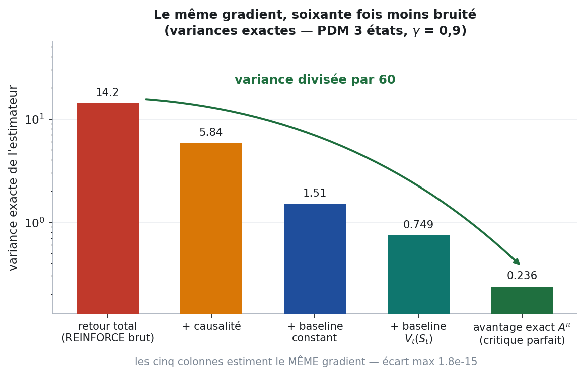
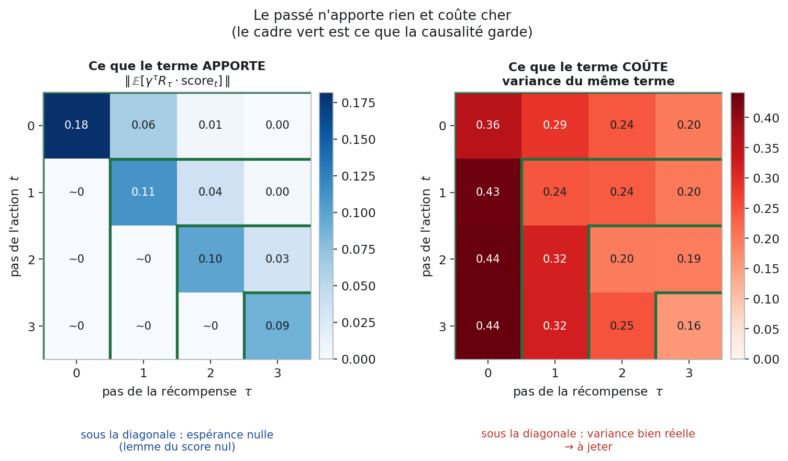
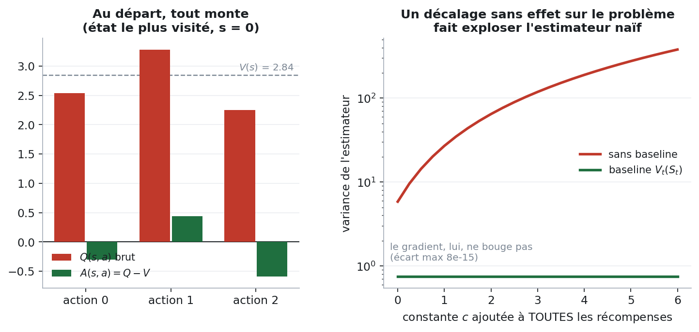
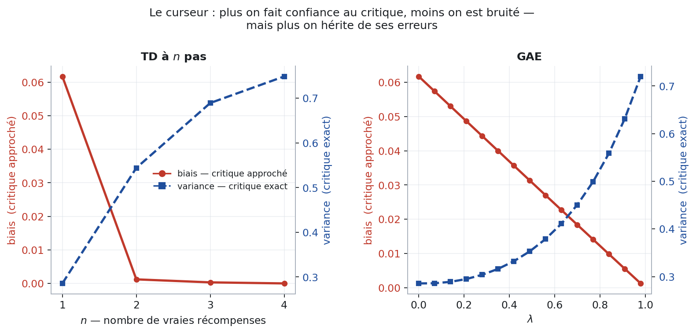
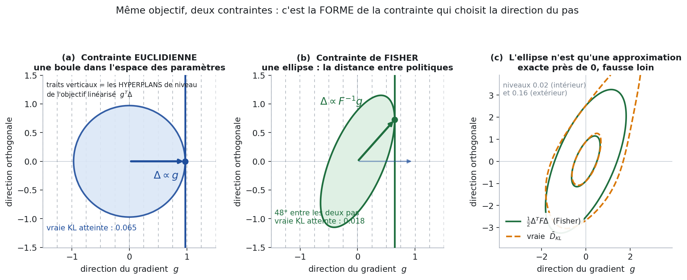
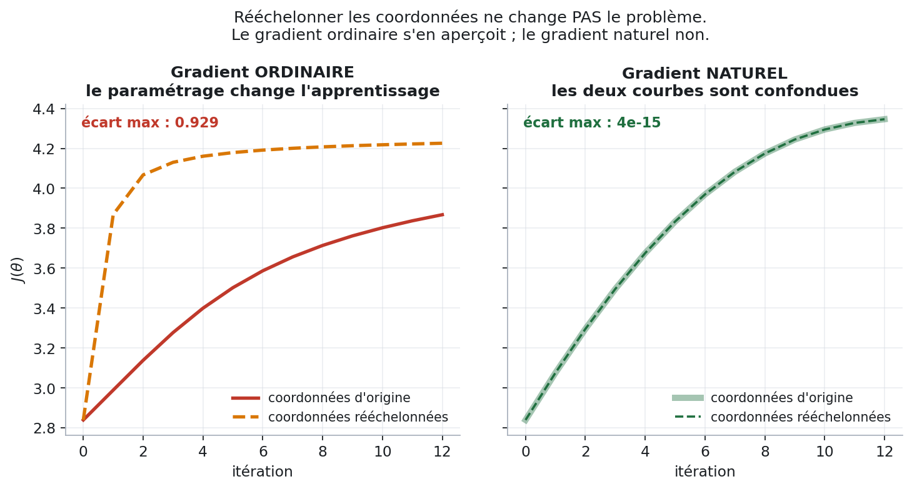
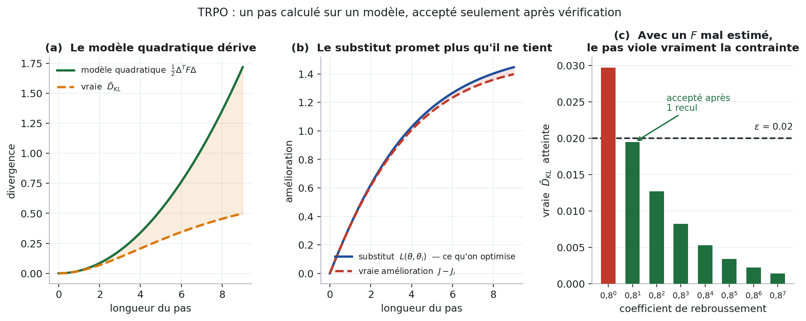
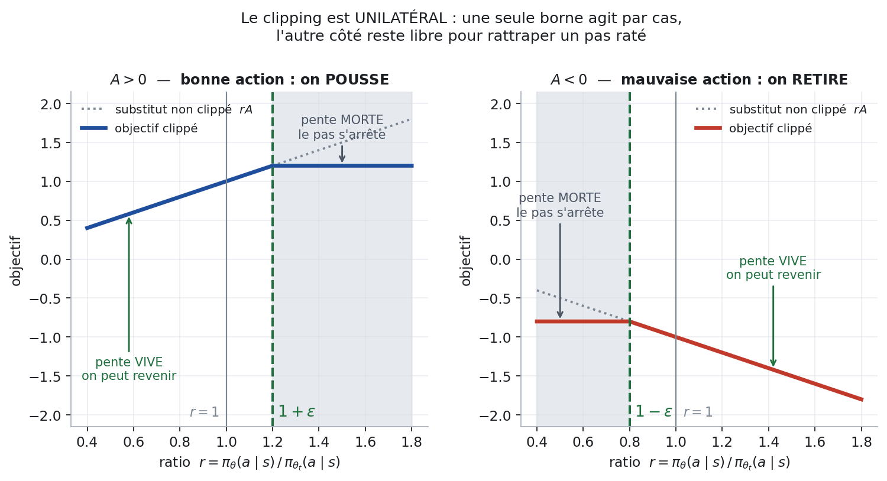
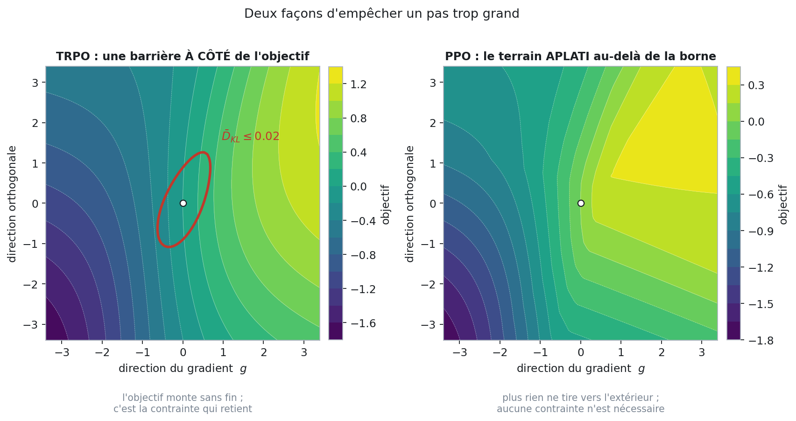
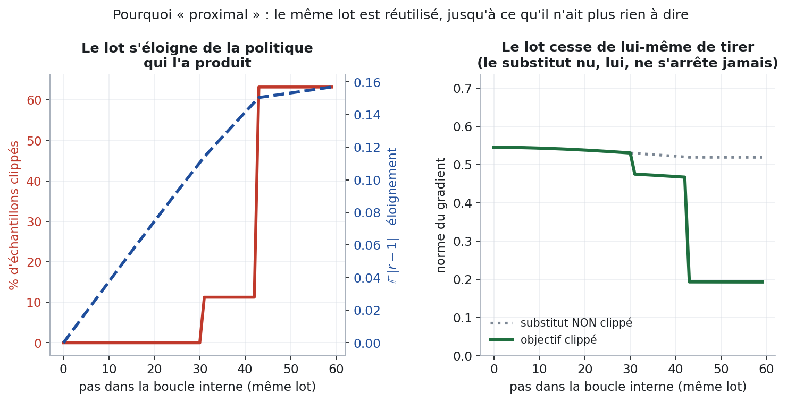

# De REINFORCE à PPO — la version intuitive

> Version vulgarisée de [`fiche-policy-gradient.md`](fiche-policy-gradient.md), qui contient les mêmes résultats **avec toutes les démonstrations**. Ici on ne démontre rien : on explique **quel défaut chaque famille d'algorithmes vient réparer**, et on le montre.
>
> **Tous les chiffres de ce document sont mesurés**, pas illustratifs. Ils viennent d'un PDM jouet à 3 états et 3 actions dont les **2187 trajectoires sont énumérées une par une** : aucune simulation, aucun bruit d'échantillonnage, les espérances sont exactes. Script : [`figures/make_figures.py`](figures/make_figures.py) · valeurs brutes : [`figures/valeurs.txt`](figures/valeurs.txt).

---

## Le fil rouge en une image

Chaque méthode naît d'un défaut de la précédente. Retenir la chaîne des défauts, c'est retenir le cours.


| Étape | Ce qu'elle répare | Ce qu'elle coûte |
|---|---|---|
| REINFORCE | rien — c'est le point de départ | variance énorme |
| Causalité | le passé pollue le signal | rien du tout |
| Baseline | le niveau absolu des récompenses domine le signal | il faut estimer ce baseline |
| Critique + GAE | quel baseline, et à quel horizon | un réseau de plus, et un biais si mal appris |
| Gradient naturel | le pas dépend du paramétrage | il faut inverser une matrice géante |
| TRPO | l'approximation quadratique ne vaut que localement | lourd, incompatible avec dropout |
| PPO | tout le second ordre | le garde-fou devient heuristique |

---

## 1. Le problème de départ

**Le défaut.** On veut maximiser la récompense espérée $`J(\theta)`$ en montant son gradient. Mais l'espérance porte sur des trajectoires **tirées par la politique elle-même** : quand $`\theta`$ change, la loi change. On ne peut pas dériver sous l'espérance.

**L'idée.** Une identité algébrique déplace la dérivée : de la loi, elle passe sur le **logarithme** de la loi.

```math
\nabla_\theta J(\theta) = \mathbb{E}_{\tau \sim \pi_\theta}\big[\, \Psi(\tau) \, \nabla_\theta \ln \pi_\theta(\tau) \,\big]
```

**En français.** « Le gradient de la moyenne d'une chose = la moyenne de (cette chose × la direction qui rend la trajectoire plus probable). » On ne dérive plus une loi : on **pondère des trajectoires observées** par leur qualité. Tout le reste du cours consiste à choisir intelligemment le poids $`\Psi`$.

**Le prix.** Il faut échantillonner. Et un estimateur par échantillonnage a une variance — c'est le fil de toute la première moitié du document.

> Démonstration : [§2.1](fiche-policy-gradient.md#21-lidentité-fondamentale) de la fiche rigoureuse.

---

## 2. REINFORCE — le point de départ

**L'idée.** On joue un épisode, on regarde le retour total, et on pousse **toutes** les actions de l'épisode proportionnellement à ce retour. Bon épisode → toutes ses actions deviennent plus probables.

```math
\Psi_t = \sum_{\tau=0}^{T} \gamma^\tau R_\tau \qquad \text{(le même retour pour tous les } t\text{)}
```

**En français.** « L'équipe a gagné, donc tout le monde a bien joué. »

**Le défaut, mesuré.** C'est évidemment faux, et ça se paie en variance. Sur le PDM jouet, la variance exacte de cet estimateur vaut **14,18**. Les quatre réparations qui suivent la ramènent à **0,236** — **60 fois moins de bruit pour exactement le même gradient** (écart entre les cinq estimateurs : 1,8·10⁻¹⁵, c'est-à-dire zéro).



Cette figure est le plan des sections 3 à 5 : chaque colonne est une réparation.

> [§2.4](fiche-policy-gradient.md#24-lalgorithme) de la fiche rigoureuse.

---

## 3. Réparation 1 — la causalité

**Le défaut.** Une action prise au pas 3 est créditée des récompenses reçues aux pas 0, 1, 2. Elle n'y est pour rien : elle n'existait pas encore.

**L'idée.** Ne créditer une action que de ce qui vient **après** elle.

```math
\Psi_t = \sum_{\tau \ge t} \gamma^\tau R_\tau
```

**En français.** « On ne juge un choix que sur ses conséquences, pas sur ce qui le précède. »

**Ce que ça change, mesuré.** Les termes jetés ont une espérance **rigoureusement nulle** — c'est le *lemme du score nul*, et sur le banc d'essai leur espérance vaut au maximum 3,7·10⁻¹⁷. Mais leur **variance**, elle, est bien réelle : elle représente **49 % de la variance totale**. On jette donc de la moitié du bruit sans toucher au signal.



À gauche, ce que chaque couple (action au pas $`t`$, récompense au pas $`\tau`$) apporte : sous la diagonale, ~0 partout. À droite, ce qu'il coûte : sous la diagonale, des valeurs comparables à celles du triangle gardé. **Le cadre vert est ce que la causalité conserve.**

**Le prix.** Aucun. C'est la seule amélioration entièrement gratuite du cours.

> [§2.2](fiche-policy-gradient.md#22-le-lemme-du-score-nul) et [§2.3](fiche-policy-gradient.md#23-lastuce-de-causalité).

---

## 4. Réparation 2 — le baseline

**Le défaut.** Si toutes les récompenses sont positives, **toutes** les actions sont poussées vers le haut. Le classement entre elles n'est encodé que par l'écart d'intensité — un signal noyé dans un niveau absolu qui, lui, ne veut rien dire.

**L'idée.** Retrancher une référence qui ne dépend pas de l'action choisie.

```math
\Psi_t = \gamma^t \Big( G_t - b(S_t) \Big)
```

**En français.** « Ce qui compte, ce n'est pas d'avoir marqué 12 points, c'est d'avoir marqué 12 points là où on en attendait 10. »

**Pourquoi c'est licite.** $`b`$ ne dépendant pas de l'action, le terme qu'on retranche a une espérance nulle — le même lemme qu'en §3. Le gradient est donc **exactement** le même ; seule la variance change.

**Le meilleur choix de $`b`$** est la valeur de l'état, $`V^\pi(S_t)`$ : la moyenne de ce qu'on peut espérer depuis là. Le poids devient l'**avantage** : *combien cette action fait mieux que la moyenne de l'état*.



À gauche, l'état le plus visité du PDM jouet : les trois actions ont $`Q`$ = +2,54 / +3,28 / +2,25, toutes positives, toutes poussées vers le haut. Après soustraction de $`V`$ = 2,84 : −0,30 / +0,44 / −0,59 — une action montée, deux descendues.

À droite, la preuve que le niveau absolu est bien du bruit pur : on ajoute une constante $`c`$ à **toutes** les récompenses, ce qui ne change rigoureusement rien au problème (ni l'ordre des politiques, ni le gradient — écart mesuré 8·10⁻¹⁵). L'estimateur sans baseline passe pourtant de 5,84 à **379** de variance, pendant que celui avec baseline reste à 0,75. À $`c = 6`$, un facteur **507**.

**Le prix.** Il faut connaître $`V^\pi`$. On ne le connaît pas.

> [§3.1](fiche-policy-gradient.md#31-reinforce-avec-baseline) et [§3.2](fiche-policy-gradient.md#32-le-meilleur-baseline--la-fonction-de-valeur).

---

## 5. Réparation 3 — le critique, et le curseur GAE

**Le défaut.** On veut $`V^\pi`$, on ne l'a pas. On l'apprend donc avec un second réseau : le **critique**. Mais un critique appris est faux, et un critique faux introduit un biais.

**L'idée.** Un curseur entre deux extrêmes :

- faire confiance au critique tout de suite (**TD à 1 pas**) : peu de bruit, mais on hérite de toutes ses erreurs ;
- ne lui faire confiance qu'à la fin (**Monte-Carlo**) : aucun biais, mais tout le bruit de l'épisode.

**GAE** est le mélange lisse de tous les intermédiaires, réglé par un seul nombre $`\lambda \in [0,1]`$ :

```math
\hat{A}_t = \sum_{l \ge 0} (\gamma\lambda)^l \, \delta_{t+l}
\qquad\text{avec}\qquad
\delta_t = R_t + \gamma V(S_{t+1}) - V(S_t)
```

**En français.** $`\delta_t`$ est la **surprise** du pas $`t`$ : ce qu'on a vraiment obtenu, moins ce que le critique annonçait. GAE additionne les surprises futures avec un oubli géométrique. $`\lambda = 0`$ : je ne regarde que la surprise immédiate. $`\lambda = 1`$ : je regarde tout l'épisode.



**Le point important, souvent mal dit.** Avec un critique **exact**, *aucune* valeur de $`n`$ ou de $`\lambda`$ n'introduit de biais — toutes les variantes visent le même gradient. Le biais ne vient **que** de l'imperfection du critique, et il décroît en $`\gamma^n`$ : sur le banc, avec un critique bruité, le biais passe de 0,062 ($`n=1`$) à 0,0012 ($`n=2`$) puis s'éteint. La variance, elle, monte quoi qu'il arrive : 0,286 → 0,544 → 0,689 → 0,749, **même avec un critique parfait**. Les deux courbes ne mesurent donc pas la même chose, et c'est pour ça qu'un curseur existe.

**Le prix.** Deux hyperparamètres de plus, et un réseau à entraîner.

> [§3.5](fiche-policy-gradient.md#35-la-forme-générale--le-par-cœur-central) et [§3.6](fiche-policy-gradient.md#36-gae). Attention : la page Wikipédia se trompe sur la pondération de GAE — l'écart est documenté dans la fiche rigoureuse.

---

## 6. Réparation 4 — le gradient naturel ★

C'est le passage le plus subtil du cours, et le seul qui ne parle pas de variance.

### 6.1 Le défaut : un pas de gradient est un problème sous contrainte déguisé

La mise à jour ordinaire $`\theta \leftarrow \theta + \alpha g`$ n'a rien d'évident. Elle est **exactement** la solution de :

```math
\begin{cases}
\max_{\Delta} \; g^{T}\Delta & \text{(monter l'objectif, linéarisé)}\\[0.4ex]
\Vert \Delta \Vert \le r & \text{(sans aller trop loin)}
\end{cases}
```

**En français.** « Va dans la direction qui monte le plus, sans sortir d'une boule de rayon $`r`$. »

Lisez la seconde ligne. **Une boule de rayon $`r`$ — dans quel espace ?** Dans celui des paramètres. Or ce n'est qu'un système de coordonnées, choisi par l'ingénieur qui a écrit le réseau. Deux paramétrages de la **même** famille de politiques donnent deux boules différentes, donc deux pas différents.

### 6.2 Voir le problème : hyperplans, boule et ellipse

L'objectif $`g^{T}\Delta`$ est **linéaire**. Ses lignes de niveau sont des **hyperplans parallèles**, tous perpendiculaires à $`g`$. Maximiser une forme linéaire sous contrainte, c'est donc pousser un hyperplan aussi loin que possible jusqu'à ce qu'il **touche** le bord du domaine admissible. Le point de contact est le pas.

Deux domaines admissibles, deux points de contact, deux directions :



- **(a)** domaine = une **boule** dans l'espace des paramètres → le contact est sur l'axe de $`g`$ → $`\Delta \propto g`$, le gradient ordinaire.
- **(b)** domaine = une **ellipse**, celle de la matrice de Fisher, qui mesure *de combien la politique change* → le contact se déplace → $`\Delta \propto F^{-1}g`$, le gradient **naturel**. Sur ce PDM, les deux directions font **48°** l'une avec l'autre.

*L'objectif est le même dans les deux panneaux. Seule la forme de la contrainte change — et c'est elle qui choisit la direction.*

**Ce que la contrainte de Fisher achète, mesuré.** À longueur de pas égale, le pas euclidien gagne plus d'objectif linéarisé (0,530 contre 0,352) — mais il déforme la politique **3,6 fois plus** (vraie divergence KL de 0,065 contre 0,018). Rapporté à ce qui compte vraiment, c'est-à-dire *combien on progresse par unité de changement de comportement*, le pas naturel est **2,4 fois plus efficace** (19,3 contre 8,1).

**En français.** Le pas euclidien va vite dans la mauvaise unité. Il mesure son déplacement en « distance entre nombres dans un tableau » ; le pas naturel le mesure en « distance entre comportements ».

### 6.3 La preuve que le paramétrage compte : deux réglages, un seul problème

Prenons la **même** famille de politiques, le **même** point de départ, le **même** pas d'apprentissage — et changeons seulement l'échelle des coordonnées (un rééchelonnement diagonal, exactement ce que fait un changement d'initialisation ou de normalisation de couche).



- **Gradient ordinaire** : les deux courbes divergent, écart **0,93** sur $`J`$ après 12 itérations. Le paramétrage a changé l'apprentissage alors qu'il n'a rien changé au problème.
- **Gradient naturel** : les deux courbes sont **superposées à 3,6·10⁻¹⁵ près**. Invariance exacte, pas approximative.

C'est ça, « naturel » : la mise à jour ne dépend que de la politique, jamais des coordonnées choisies pour l'écrire.

### 6.4 La formule

Le domaine admissible « la politique ne change pas trop » s'écrit avec la divergence KL, et pour un petit pas cette KL est une **forme quadratique** — l'ellipse de la figure :

```math
\bar{D}_{KL} \approx \tfrac{1}{2}\Delta^{T} F \Delta
\qquad\Longrightarrow\qquad
\Delta = \sqrt{\frac{2\epsilon}{g^{T}F^{-1}g}} \; F^{-1} g
```

**En français.** « Même direction de montée, mais corrigée par $`F^{-1}`$ : les directions de $`\theta`$ qui bouleversent la politique reçoivent un petit pas, celles qui ne changent presque rien reçoivent un grand pas. »

**Le prix, et il est rédhibitoire.** $`F`$ est carrée de la taille du réseau. Pour un million de paramètres, c'est mille milliards de coefficients à former, puis à inverser. Hors de question.

> [§4.1](fiche-policy-gradient.md#41-motivation--le-pas-de-gradient-est-un-problème-sous-contrainte-déguisé) à [§4.4](fiche-policy-gradient.md#44-le-programme-quadratique-et-sa-solution).

---

## 7. Réparation 5 — TRPO : ne faire le pas que s'il tient ses promesses

**Le défaut.** Deux mensonges se cachent dans le calcul du gradient naturel :

1. l'ellipse de Fisher n'est qu'une **approximation** de la vraie KL, valable près de zéro ;
2. l'objectif linéarisé n'est qu'une **approximation** de la vraie amélioration.

Rien ne garantit donc que le pas calculé respecte vraiment la contrainte, ni qu'il améliore vraiment $`J`$.

**L'idée, en deux ajouts.**

- **Ne jamais former $`F`$.** Le gradient conjugué résout $`Fx = g`$ en n'utilisant que des produits $`F v`$, qui se calculent sans écrire la matrice. Une dizaine d'itérations suffisent.
- **Vérifier avant d'accepter.** On calcule le pas, puis on le teste vraiment : la KL réelle est-elle sous $`\epsilon`$ ? le substitut a-t-il vraiment monté ? Si non, on **recule** — le pas est multiplié par 0,8, et on retente — jusqu'à ce que les deux tests passent.



**Ce que les mesures disent.**

- **(a)** Le modèle quadratique colle près de zéro (rapport vraie KL / modèle = 0,96 pour un pas court) et dérive franchement pour un pas long (0,29). L'ellipse **n'est pas** la vraie KL.
- **(b)** Le substitut surestime l'amélioration réelle : +0,36 % pour un pas court, +3,5 % pour un pas long. Il promet toujours un peu plus qu'il ne tient, et l'écart grandit avec le pas.
- **(c)** La vérification n'est pas décorative. Avec un $`F`$ **mal estimé** — ce qui est le cas réel, puisqu'on l'estime sur un lot fini — le pas calculé pour $`\epsilon = 0{,}02`$ atteint en fait une KL de **0,0297**, soit **1,5 fois trop**. Un seul rebroussement le ramène à 0,0195, sous la barre.

**Le prix.** Un algorithme lourd : produits Fisher-vecteur, gradient conjugué, recherche linéaire. Et la contrainte de second ordre interdit en pratique le dropout et le partage de paramètres entre acteur et critique.

> [§5.1](fiche-policy-gradient.md#51-le-programme) à [§5.5](fiche-policy-gradient.md#55-ajout-2--recherche-linéaire-par-rebroussement).

---

## 8. Réparation 6 — PPO : mettre la limite DANS l'objectif

**Le défaut.** TRPO marche, mais il faut tout ce second ordre pour poser une barrière **à côté** de l'objectif.

**L'idée, qui est la seule chose vraiment neuve de PPO.** Plutôt que d'interdire d'aller trop loin, on fait en sorte que **plus rien ne tire vers le trop loin**. On aplatit l'objectif au-delà de la limite : il n'y a alors plus besoin de contrainte du tout, et on retombe sur de la descente de gradient ordinaire.

### 8.1 L'objectif clippé

Soit $`r = \pi_\theta(a \mid s) / \pi_{\theta_t}(a \mid s)`$, le rapport entre la politique en cours d'entraînement et celle qui a produit les données. Au départ $`r = 1`$.

```math
L^{CLIP} = \mathbb{E}\Big[\min\big(r A,\; \mathrm{clip}(r, 1-\epsilon, 1+\epsilon)\,A\big)\Big]
```

**En français.** « Pousse tant que la politique n'a pas trop bougé. Passé la borne, le terrain devient plat : le gradient meurt tout seul, sans qu'on ait rien à interdire. »



**Le point que tout le monde rate — le clipping est unilatéral.** Une seule borne agit dans chaque cas :

- $`A > 0`$ (bonne action, on pousse vers le haut) : seule $`1+\epsilon`$ compte. Au-delà, pente morte. Mais **en dessous** la pente reste vive.
- $`A < 0`$ (mauvaise action, on pousse vers le bas) : seule $`1-\epsilon`$ compte. Symétriquement.

Ce n'est pas un détail d'implémentation : c'est ce qui permet de **rattraper un pas raté**. Si un pas précédent a trop poussé une action, le côté libre laisse le gradient la ramener. Un clipping bilatéral gèlerait l'échantillon définitivement.

### 8.2 Barrière contre terrain plat



Les deux paysages sont calculés sur le PDM jouet, dans le même plan. À gauche le substitut de TRPO : il monte sans fin (jusqu'à 1,22 au bord de la fenêtre), c'est le trait rouge — la contrainte KL — qui retient. À droite l'objectif clippé de PPO : il **sature** (0,308 au maximum, 0,298 au bord). Rien ne tire vers l'extérieur, donc aucune barrière n'est nécessaire.

### 8.3 D'où vient le mot *proximal*

**Le défaut qu'on répare ici** est différent : le substitut suppose que les données ont été produites par la politique courante. Dès que $`\theta`$ s'éloigne de $`\theta_t`$, cette hypothèse est fausse — le substitut devient de plus en plus faux.

**L'idée.** Réutiliser le même lot pour plusieurs pas de gradient, mais rester **proche** ( *proximal* ) de la politique qui l'a produit. Le clipping s'en charge tout seul.



Une vraie boucle interne, 60 pas sur un même lot :

- au premier pas, $`r = 1`$ partout : **0 %** d'échantillons clippés, l'objectif clippé est exactement le substitut ordinaire ;
- à mesure que $`\theta`$ s'éloigne, les échantillons franchissent leur borne un par un — **63 %** à la fin ;
- chaque échantillon franchi voit **son** gradient s'annuler. La norme du gradient passe de 0,546 à 0,193, soit une extinction d'un facteur **2,8**, pendant que celle du substitut **non** clippé reste à 0,519 : lui ne s'arrêterait jamais.

*(L'escalier vient de la taille du jouet : il n'y a que 9 couples état-action, donc 9 marches possibles. Sur un vrai lot la courbe est lisse.)*

**Ce que ça achète.** REINFORCE devait jeter chaque lot après un seul pas. PPO le réutilise une dizaine de fois. C'est là que se trouve l'essentiel du gain en efficacité d'échantillons.

**Le prix.** Le garde-fou n'est plus qu'une **heuristique** : $`\epsilon`$ borne le ratio pour chaque échantillon pris isolément, ce qui ne borne pas la divergence KL globale. PPO ne garantit plus rien — il marche, c'est tout.

> [§6.1](fiche-policy-gradient.md#61-lobjectif) à [§6.4](fiche-policy-gradient.md#64-la-boucle-interne--doù-vient-le-mot-proximal).

---

## 9. Le tableau final

| Étape | Le défaut réparé | Comment | Le prix payé |
|---|---|---|---|
| **REINFORCE** | — | pondérer les actions par le retour | variance 14,18 |
| **Causalité** | le passé est crédité à tort | ne garder que le futur | aucun (49 % du bruit part) |
| **Baseline** | le niveau absolu écrase le signal | retrancher $`V(S_t)`$ | il faut estimer $`V`$ |
| **Critique + GAE** | quel horizon de confiance | curseur $`\lambda`$ sur les surprises | un réseau, un biais si mal appris |
| **Gradient naturel** | le pas dépend du paramétrage | contrainte en KL, pas en $`\Vert\theta\Vert`$ | $`F^{-1}`$ impraticable |
| **TRPO** | l'approximation ne vaut que de près | gradient conjugué + vérification | lourd, pas de dropout |
| **PPO** | tout le second ordre | aplatir l'objectif au lieu de contraindre | plus aucune garantie |

---

## 10. Les six phrases à retenir

1. **On ne dérive pas une loi qui bouge** — on pondère des trajectoires par la direction qui les rend plus probables.
2. **Le passé n'apporte rien et coûte la moitié du bruit** — d'où la causalité.
3. **Un baseline ne change pas le gradient, seulement sa netteté** — n'importe quelle référence indépendante de l'action est licite ; $`V(S_t)`$ est la meilleure.
4. **Le biais ne vient jamais de $`\lambda`$, il vient du critique** — avec un critique exact, tout le tableau est non biaisé.
5. **Un pas de gradient est une boule dans un système de coordonnées arbitraire** — le gradient naturel remplace cette boule par une ellipse qui mesure des politiques, pas des nombres.
6. **PPO n'interdit pas d'aller trop loin : il fait qu'il n'y a plus aucune raison d'y aller.**

---

> **Le curseur $`\lambda`$ n'est pas qu'une affaire de théorie.** L'assertion #33c bis de [`verif/verify_fiche.py`](verif/verify_fiche.py) établit numériquement que la variance de GAE croît avec $`\lambda`$, et vaut son maximum en $`\lambda = 1`$. Or c'est **exactement** la valeur par défaut de RLlib — et [05 §5.2](05-mesures.md) mesure ce que ça coûte sur trois tâches MuJoCo : la corriger est le levier le plus rentable du dépôt.

## 11. Pour aller plus loin

| Document | Ce qu'on y trouve |
|---|---|
| [`fiche-policy-gradient.md`](fiche-policy-gradient.md) | le même parcours avec **toutes les démonstrations**, plus GRPO et MDPO. C'est le document à apprendre. |
| [`verif/README.md`](verif/README.md) | comment chaque formule de la fiche a été vérifiée par machine (72 assertions + 14 fautes injectées) |
| [`comprendre-le-papier-ppo.md`](01-comprendre-le-papier-ppo.md) | lecture du papier PPO original |
| [`rapport-ppo-ray-vs-papier.md`](02-ppo-papier-vs-rllib.md) | ce que Ray/RLlib implémente réellement, et où il s'écarte du papier |
| [`figures/make_figures.py`](figures/make_figures.py) | le script qui produit toutes les figures ci-dessus |

**Refaire les figures :**

```bash
python3 rapport/figures/make_figures.py
```
