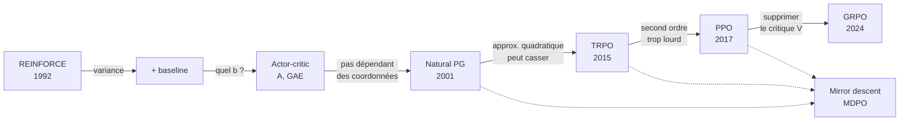

# Fiche de révision — Méthodes de gradient de politique

De REINFORCE à PPO, en suivant la page [Policy gradient method](https://en.wikipedia.org/wiki/Policy_gradient_method) de Wikipédia. Toutes les formules de cette page sont ici, avec leur démonstration.

**Fil directeur** : chaque méthode répare un défaut précis de la précédente. Retenir la chaîne des défauts, c'est retenir la moitié du cours.

> Cette fiche est le **cours amont** du reste du dépôt. Elle s'arrête là où le papier PPO commence. Pour la suite : [comprendre le papier](01-comprendre-le-papier-ppo.md), puis ce que RLlib en fait réellement ([02](02-ppo-papier-vs-rllib.md), [03](03-gae-papier-vs-rllib.md)) et ce que ça coûte en pratique ([05, mesuré](05-mesures.md)).

| Méthode | Ce qu'on maximise | Garde-fou | Ordre | Défaut résiduel |
|---|---|---|---|---|
| REINFORCE | $`J(\theta)`$ par Monte-Carlo | aucun | 1 | variance énorme |
| + baseline | idem, poids $`G_t - b(S_t)`$ | aucun | 1 | il faut un bon $`b`$ |
| Actor-critic | idem, poids $`A^\pi`$ ou GAE | aucun | 1 | pas trop grand ⇒ divergence |
| NPG | linéarisation $`g^T\Delta`$ | $`\bar D_{KL} \le \epsilon`$ | 2 | inverser $`F`$ est prohibitif |
| TRPO | surrogate $`L(\theta,\theta_i)`$ | $`\bar D_{KL} \le \epsilon`$ dure | 2 | lourd, incompatible dropout |
| PPO | surrogate **clippé** | ratio borné dans $`[1-\epsilon, 1+\epsilon]`$ | 1 | garde-fou heuristique |
| GRPO | idem PPO | idem | 1 | il faut $`G`$ échantillons par état |



---

## 1. Le cadre

L'acteur est une politique paramétrée $`\pi_\theta`$, différentiable en $`\theta`$. Elle prend un état $`s`$ et rend une **distribution de probabilité** $`\pi_\theta(\cdot \mid s)`$ :

- action discrète : $`\sum_a \pi_\theta(a \mid s) = 1`$ ;
- action continue : $`\int_a \pi_\theta(a \mid s)\,\mathrm{d}a = 1`$.

L'objectif est la récompense épisodique espérée :

```math
J(\theta) = \mathbb{E}_{\pi_\theta}\left[\sum_{t=0}^T \gamma^t R_t \;\Big|\; S_0 = s_0 \right]
```

avec $`\gamma`$ le facteur d'actualisation, $`R_t`$ la récompense au pas $`t`$, $`T`$ l'horizon (éventuellement infini). Le **gradient de politique** est $`\nabla_\theta J(\theta)`$, et toute méthode de gradient de politique fait de la montée de gradient sur $`J`$ :

```math
\theta_{i+1} = \theta_i + \alpha \nabla_\theta J(\theta_i)
```

**La difficulté centrale.** On ne peut pas dériver sous l'espérance naïvement : la loi sur laquelle porte l'espérance dépend elle-même de $`\theta`$. Toute la section 2 sert à transformer $`\nabla_\theta J`$ en une **espérance de quelque chose d'échantillonnable**. C'est pourquoi ces méthodes sont aussi étudiées sous le nom d'*estimation Monte-Carlo de gradient*.

**Contraste.** Les méthodes à base de valeur apprennent $`Q`$ puis en déduisent une politique. Ici on apprend directement $`\pi_\theta`$, sans consulter de fonction de valeur — même si on finira par en utiliser une comme *critique*, ce qui est autre chose.

---

## 2. REINFORCE (Williams, 1992)

### 2.1 L'identité fondamentale

```math
\nabla_\theta J(\theta) = \mathbb{E}_{\pi_\theta}\left[
\sum_{t=0}^T \nabla_\theta\ln\pi_\theta(A_t \mid S_t)\; \sum_{t=0}^T (\gamma^t R_t)
 \;\Big|\; S_0 = s_0
 \right]
```

**Démonstration.** Une trajectoire $`\tau = (s_0, a_0, s_1, a_1, \dots)`$ a pour densité

```math
P_\theta(\tau) = p(s_0) \prod_{t=0}^{T} \pi_\theta(a_t \mid s_t)\, p(s_{t+1} \mid s_t, a_t)
```

Posons $`R(\tau) = \sum_t \gamma^t R_t`$, de sorte que $`J(\theta) = \sum_\tau P_\theta(\tau) R(\tau)`$. Alors

```math
\nabla_\theta J(\theta) = \sum_\tau \nabla_\theta P_\theta(\tau)\, R(\tau)
= \sum_\tau P_\theta(\tau)\, \frac{\nabla_\theta P_\theta(\tau)}{P_\theta(\tau)}\, R(\tau)
= \mathbb{E}_{\tau \sim \pi_\theta}\big[\nabla_\theta \ln P_\theta(\tau)\, R(\tau)\big]
```

C'est l'**astuce du log-ratio** (ou *reparameterization trick* au sens REINFORCE) : $`\nabla P = P\,\nabla \ln P`$. Elle transforme un gradient de mesure en espérance sous cette mesure.

Reste à calculer $`\nabla_\theta \ln P_\theta(\tau)`$ :

```math
\ln P_\theta(\tau) = \underbrace{\ln p(s_0) + \sum_t \ln p(s_{t+1} \mid s_t, a_t)}_{\text{indépendant de } \theta} + \sum_t \ln \pi_\theta(a_t \mid s_t)
```

Les termes de dynamique **disparaissent au gradient**. C'est le point crucial : on n'a **pas besoin de connaître le modèle de l'environnement**. Il reste

```math
\nabla_\theta \ln P_\theta(\tau) = \sum_{t=0}^T \nabla_\theta \ln \pi_\theta(a_t \mid s_t)
```

d'où l'identité. $`\blacksquare`$

Le terme $`\nabla_\theta \ln \pi_\theta(a \mid s)`$ s'appelle la **fonction de score**.

### 2.2 Le lemme du score nul

C'est l'outil qui justifie *toutes* les réductions de variance qui suivent. À connaître par cœur.

> **Lemme.** L'espérance de la fonction de score est nulle, conditionnellement à tout état présent ou passé. Pour tous $`0 \le i \le j \le T`$ et tout état $`s_i`$ :
>
> ```math
> \mathbb{E}_{\pi_\theta}\big[\nabla_\theta \ln \pi_\theta (A_j \mid S_j) \mid S_i = s_i\big] = 0
> ```
>
> De plus, si $`\Psi_i`$ est une variable aléatoire **indépendante de** $`A_i, S_{i+1}, A_{i+1}, \dots`$ alors
>
> ```math
> \mathbb{E}_{\pi_\theta}\big[\nabla_\theta \ln \pi_\theta(A_j \mid S_j) \cdot \Psi_i \mid S_i = s_i\big] = 0
> ```

**Démonstration (première partie).**

```math
\begin{aligned}
\mathbb{E}_{\pi_\theta}\big[\nabla_\theta \ln \pi_\theta (A_j \mid S_j) \mid S_i = s_i\big]
&= \sum_s \Pr(S_j = s \mid S_i = s_i) \sum_a \pi_\theta(a \mid s)\, \nabla_\theta \ln \pi_\theta (a \mid s) \\
&= \sum_s \Pr(S_j = s \mid S_i = s_i) \sum_a \pi_\theta(a \mid s)\, \frac{\nabla_\theta \pi_\theta (a \mid s)}{\pi_\theta(a \mid s)} \\
&= \sum_s \Pr(S_j = s \mid S_i = s_i) \sum_a \nabla_\theta \pi_\theta (a \mid s) \\
&= \sum_s \Pr(S_j = s \mid S_i = s_i)\, \nabla_\theta \underbrace{\sum_a \pi_\theta (a \mid s)}_{= 1} \\
&= \sum_s \Pr(S_j = s \mid S_i = s_i) \cdot \nabla_\theta 1 = 0
\end{aligned}
```

Tout tient dans la dernière ligne : **une distribution somme à 1, donc le gradient de cette somme est nul**. $`\blacksquare`$

**Démonstration (seconde partie).** Comme $`\Psi_i`$ ne dépend que de ce qui précède $`A_i`$, on conditionne d'abord sur toute l'histoire jusqu'à $`S_j`$ :

```math
\mathbb{E}\big[\nabla_\theta \ln \pi_\theta(A_j \mid S_j) \cdot \Psi_i \mid S_i\big]
= \mathbb{E}\Big[\Psi_i \cdot \underbrace{\mathbb{E}\big[\nabla_\theta \ln \pi_\theta(A_j \mid S_j) \mid S_j, \Psi_i\big]}_{= 0 \text{ par la première partie}} \;\Big|\; S_i\Big] = 0
```

On a utilisé la **loi de la tour** (espérance itérée) : $`\Psi_i`$ sort de l'espérance intérieure car il y est mesurable. $`\blacksquare`$

> **Point de rigueur.** Le conditionnement intérieur doit porter sur $`(S_j, \Psi_i)`$ — ou sur toute l'histoire jusqu'à $`S_j`$ — et non sur $`S_j`$ seul : $`\Psi_i`$ n'est pas une fonction de $`S_j`$, on ne peut donc pas le sortir d'une espérance conditionnée au seul $`S_j`$. La preuve de la page Wikipédia écrit $`\mathbb{E}[\Psi_i \nabla\ln\pi \mid S_j] = \Psi_i\,\mathbb{E}[\nabla\ln\pi \mid S_j]`$, ce qui saute cette étape. Le résultat est le même, l'argument correct est celui ci-dessus.
>
> L'hypothèse « $`\Psi_i`$ indépendant de $`A_i, S_{i+1}, \dots`$ » est **stricte** : inclure $`R_i`$, qui dépend de $`A_i`$, casse le lemme (vérifié : test #4).

### 2.3 L'astuce de causalité

Une action ne peut pas influencer les récompenses **passées**. On peut donc supprimer ces termes de l'identité :

```math
\nabla_\theta J(\theta) = \mathbb{E}_{\pi_\theta}\left[\sum_{t=0}^T \nabla_\theta\ln\pi_\theta(A_t \mid S_t)\sum_{\tau=t}^T (\gamma^\tau R_\tau)
 \;\Big|\; S_0 = s_0 \right]
```

**Démonstration.** Dans le double produit, prenons un terme croisé avec $`\tau < t`$ :

```math
\mathbb{E}\big[\nabla_\theta \ln \pi_\theta(A_t \mid S_t) \cdot \gamma^\tau R_\tau\big]
```

La quantité $`\gamma^\tau R_\tau`$ est une fonction de $`S_\tau, A_\tau, S_{\tau+1}`$, donc indépendante de $`A_t, S_{t+1}, \dots`$ dès que $`\tau < t`$. Le lemme (seconde partie, avec $`i = t`$, $`j = t`$, $`\Psi_t = \gamma^\tau R_\tau`$) donne 0. Tous les termes croisés « récompense avant l'action » s'annulent **en espérance**. $`\blacksquare`$

C'est une réduction de variance **gratuite** : on retire des termes d'espérance nulle mais de variance non nulle. L'estimateur reste non biaisé et devient moins bruité.

La quantité $`\sum_{\tau=t}^T \gamma^\tau R_\tau`$ est le **retour** (*return*) actualisé depuis $`t`$, souvent noté $`G_t`$ (à un facteur $`\gamma^t`$ près selon les conventions).

### 2.4 L'algorithme

```
Initialiser θ_0
Pour i = 0, 1, 2, ... :
    Collecter N trajectoires complètes avec π_{θ_i}
    Calculer l'estimateur
        g_i ← (1/N) Σ_n Σ_t ∇ln π_θ(A_{t,n} | S_{t,n}) · Σ_{τ≥t} γ^τ R_{τ,n}
    θ_{i+1} ← θ_i + α g_i
```

Points à retenir :

- **On-policy strict** : les trajectoires doivent venir de la politique courante, on les jette après une mise à jour.
- **Monte-Carlo** : il faut des épisodes **terminés** pour connaître $`G_t`$.
- **Défaut** : la variance de $`G_t`$ croît avec l'horizon. Pour un épisode long, l'estimateur est presque du bruit. C'est le problème que résout la section suivante.

---

## 3. Réduire la variance : baseline, critique, avantage

### 3.1 REINFORCE avec baseline

Pour **toute** fonction $`b : \text{États} \to \mathbb{R}`$ :

```math
\nabla_\theta J(\theta) = \mathbb{E}_{\pi_\theta}\left[\sum_{t=0}^T \nabla_\theta\ln\pi_\theta(A_t \mid S_t)\left(\sum_{\tau=t}^T (\gamma^\tau R_\tau) - b(S_t)\right)
 \;\Big|\; S_0 = s_0 \right]
```

**Démonstration.** Il suffit de montrer que le terme ajouté est d'espérance nulle :

```math
\mathbb{E}\big[\nabla_\theta \ln \pi_\theta(A_t \mid S_t) \cdot b(S_t)\big]
= \mathbb{E}\Big[\underbrace{\mathbb{E}\big[\nabla_\theta \ln \pi_\theta(A_t \mid S_t) \mid S_t\big]}_{=\,0 \text{ (lemme)}} \cdot\, b(S_t)\Big] = 0
```

C'est exactement le lemme avec $`i = j = t`$ et $`\Psi_t = b(S_t)`$, qui est bien mesurable par rapport à $`S_t`$ seul. $`\blacksquare`$

L'estimateur devient

```math
g_i \leftarrow \frac{1}{N} \sum_{n=1}^N \left[\sum_{t=0}^T \nabla_{\theta}\ln\pi_\theta(A_{t,n} \mid S_{t,n})\left(\sum_{\tau=t}^T (\gamma^\tau R_{\tau,n}) - b_i(S_{t,n})\right) \right]
```

et **REINFORCE nu est le cas particulier $`b_i \equiv 0`$**.

**Pourquoi ça marche.** Soustraire une constante (par état) ne change pas l'espérance mais change la variance. Intuitivement : sans baseline, si toutes les récompenses sont positives, toutes les actions voient leur probabilité augmenter, et seule la *taille relative* des augmentations fait le travail — très bruité. Avec baseline, une action reçoit un poids **négatif** dès qu'elle fait moins bien que la moyenne de son état.

### 3.2 Le meilleur baseline : la fonction de valeur

Si $`b_i`$ est bien choisi, c'est-à-dire si

```math
b_i(S_t) \approx \sum_{\tau=t}^T (\gamma^\tau R_\tau) = \gamma^t V^{\pi_{\theta_i}}(S_t)
```

alors la variance chute fortement. L'idéal est

```math
\nabla_\theta J(\theta) = \mathbb{E}_{\pi_\theta}\left[\sum_{t=0}^T \nabla_\theta\ln\pi_\theta(A_t \mid S_t)\left(\sum_{\tau=t}^T (\gamma^\tau R_\tau) - \gamma^t V^{\pi_\theta}(S_t)\right)
 \;\Big|\; S_0 = s_0 \right]
```

Attention au facteur $`\gamma^t`$ : le retour non-actualisé depuis $`t`$ vaut $`V^\pi(S_t)`$, mais ici la somme $`\sum_{\tau \ge t} \gamma^\tau R_\tau`$ est actualisée **depuis l'instant 0**, d'où $`\gamma^t V^\pi(S_t)`$.

Comme $`\pi_{\theta_i}`$ change à chaque itération, $`V^{\pi_{\theta_i}}`$ change aussi : **le baseline doit être réappris en continu**. On entraîne donc un second réseau qui estime $`V`$. C'est une **méthode acteur-critique** : la politique est l'*acteur*, la fonction de valeur le *critique*.

### 3.3 Q comme critique

```math
\nabla_\theta J(\theta) = \mathbb{E}_{\pi_\theta}\left[\sum_{0\leq t \leq T} \gamma^t \nabla_\theta\ln\pi_\theta(A_t \mid S_t)
\cdot Q^{\pi_\theta}(S_t, A_t)
 \;\Big|\; S_0 = s_0 \right]
```

**Démonstration (loi de la tour).** Partons de la forme causale et conditionnons sur $`(S_t, A_t)`$ :

```math
\begin{aligned}
\mathbb{E}\left[\nabla_\theta\ln\pi_\theta(A_t \mid S_t) \sum_{\tau=t}^T \gamma^\tau R_\tau\right]
&= \mathbb{E}\left[\nabla_\theta\ln\pi_\theta(A_t \mid S_t)\; \mathbb{E}\Big[\sum_{\tau=t}^T \gamma^\tau R_\tau \;\Big|\; S_t, A_t\Big]\right] \\
&= \mathbb{E}\left[\nabla_\theta\ln\pi_\theta(A_t \mid S_t)\; \gamma^t Q^{\pi_\theta}(S_t, A_t)\right]
\end{aligned}
```

car par définition $`Q^\pi(s,a) = \mathbb{E}[\sum_{k \ge 0} \gamma^k R_{t+k} \mid S_t = s, A_t = a]`$. Le facteur de score sort de l'espérance intérieure : il est mesurable par rapport à $`(S_t, A_t)`$. $`\blacksquare`$

### 3.4 L'avantage comme critique

En combinant §3.2 et §3.3 — c'est-à-dire en prenant $`Q`$ comme poids et $`V`$ comme baseline — on obtient la **fonction d'avantage** :

```math
A^{\pi}(s,a) = Q^{\pi}(s,a) - V^{\pi}(s)
```

```math
\nabla_\theta J(\theta) = \mathbb{E}_{\pi_\theta}\left[\sum_{0\leq t \leq T} \gamma^t \nabla_\theta\ln\pi_\theta(A_t \mid S_t)
\cdot A^{\pi_\theta}(S_t, A_t)
 \;\Big|\; S_0 = s_0 \right]
```

**Lecture** : « *de combien cette action est-elle meilleure que ce que la politique aurait fait en moyenne dans cet état* ». C'est la forme utilisée par TRPO, PPO et GRPO. La retenir.

### 3.5 La forme générale — le par cœur central

Il existe **beaucoup** d'estimateurs non biaisés de $`\nabla_\theta J`$, tous de la forme

```math
\nabla_\theta J(\theta) = \mathbb{E}_{\pi_\theta}\left[\sum_{0\leq t \leq T} \nabla_\theta\ln\pi_\theta(A_t \mid S_t) \cdot \Psi_t
  \;\Big|\; S_0 = s_0 \right]
```

où $`\Psi_t`$ est **une somme linéaire quelconque** des termes suivants :

| $`\Psi_t`$ | Nom / usage |
|---|---|
| $`\sum_{0 \leq \tau\leq T} (\gamma^\tau R_\tau)`$ | jamais utilisé (retour total, variance maximale) |
| $`\gamma^t\sum_{t \leq \tau\leq T} (\gamma^{\tau-t} R_\tau)`$ | **REINFORCE** |
| $`\gamma^t \sum_{t \leq \tau\leq T} (\gamma^{\tau-t} R_\tau) - b(S_t)`$ | **REINFORCE avec baseline** |
| $`\gamma^t \left(R_t + \gamma V^{\pi_\theta}(S_{t+1}) - V^{\pi_\theta}(S_t)\right)`$ | **TD à 1 pas** |
| $`\gamma^t Q^{\pi_\theta}(S_t, A_t)`$ | critique Q |
| $`\gamma^t A^{\pi_\theta}(S_t, A_t)`$ | **avantage** |
| $`\gamma^t \left(R_t + \gamma R_{t+1} + \gamma^2 V^{\pi_\theta}(S_{t+2}) - V^{\pi_\theta}(S_t)\right)`$ | TD à 2 pas |
| $`\gamma^t \left(\sum_{k=0}^{n-1} \gamma^k R_{t+k} + \gamma^n V^{\pi_\theta}(S_{t+n}) - V^{\pi_\theta}(S_t)\right)`$ | **TD à $`n`$ pas** |
| $`\gamma^t \sum_{n=1}^\infty \frac{\lambda^{n-1}}{1-\lambda} \left(\sum_{k=0}^{n-1} \gamma^k R_{t+k} + \gamma^n V^{\pi_\theta}(S_{t+n}) - V^{\pi_\theta}(S_t)\right)`$ | **TD(λ) = GAE** ⚠️ voir §3.6 |

> **⚠️ Écart vérifié — dernière ligne du tableau.** Le coefficient $`\frac{\lambda^{n-1}}{1-\lambda}`$ est celui de la page Wikipédia, mais il ne donne **pas** GAE. La somme de ses poids vaut $`\frac{1}{(1-\lambda)^2}`$ au lieu de 1 : l'estimateur obtenu est $`\frac{1}{(1-\lambda)^2}\,\nabla_\theta J`$, pas $`\nabla_\theta J`$. La normalisation du papier GAE est $`(1-\lambda)\lambda^{n-1}`$ (§3, la définition qui précède son éq. 16). Mesuré : facteur 11,111 pour $`\lambda = 0{,}7`$, soit exactement $`1/(1-\lambda)^2`$ (test #13b). C'est la formule de la page qu'il faut savoir réciter, mais en sachant qu'elle est fautive d'un facteur d'échelle.

**Le compromis biais-variance, énoncé précisément.** Attention à une confusion répandue :

- avec un critique **exact** $`V = V^{\pi_\theta}`$, **toutes** les lignes du tableau sont non biaisées, pour tout $`n`$ et tout $`\lambda`$ (vérifié : test #10) ;
- le biais n'apparaît qu'avec un critique **approché** $`\hat V`$. Il vient du terme d'amorçage $`\gamma^n \hat V(S_{t+n})`$ et décroît en $`\gamma^n`$ : $`n`$ petit ⇒ beaucoup de biais, $`n = T+1`$ (Monte-Carlo, aucun amorçage) ⇒ biais nul (test #33) ;
- la **variance**, elle, croît avec $`n`$ même quand $`\hat V`$ est exact (test #33c).

Autrement dit : $`n`$ arbitre entre le biais **du critique** et la variance **du retour**. Le papier GAE le dit ainsi : *« λ < 1 introduces bias only when the value function is inaccurate »*.

### 3.6 GAE

**GAE** (*generalized advantage estimate*, Schulman et al. 2015) est la moyenne **exponentiellement décroissante** de tous les TD à $`n`$ pas, pilotée par $`\lambda \in [0,1]`$. Sa définition dans le papier (§3, la chaîne d'égalités qui aboutit à l'éq. 16) :

```math
\hat A_t^{\mathrm{GAE}(\gamma,\lambda)} := (1-\lambda)\left(\hat A_t^{(1)} + \lambda \hat A_t^{(2)} + \lambda^2 \hat A_t^{(3)} + \dots\right)
= (1-\lambda)\sum_{n=1}^{\infty} \lambda^{n-1} \hat A_t^{(n)}
```

Le poids de l'estimateur à $`n`$ pas est donc $`(1-\lambda)\lambda^{n-1}`$ : **les poids somment à 1**, c'est une vraie moyenne pondérée. Le papier montre ensuite que cette somme se réécrit $`\sum_{l\ge0}(\gamma\lambda)^l \delta_{t+l}`$ — c'est son éq. (16), la forme qu'on code. (La dernière ligne du tableau §3.5 reprend le coefficient de Wikipédia, $`\frac{\lambda^{n-1}}{1-\lambda}`$, qui somme à $`\frac{1}{(1-\lambda)^2}`$ — voir l'avertissement ci-dessus.)

Il interpole entre les deux extrêmes :

- $`\lambda = 0`$ ⇒ TD à 1 pas (biaisé, faible variance) ;
- $`\lambda = 1`$ ⇒ Monte-Carlo (non biaisé, forte variance).

**Pourquoi $`\lambda`$ ne change que le compromis, jamais la validité.** Pour $`l \ge 1`$, $`\mathbb{E}[\delta_{t+l} \mid S_{t+l}] = \mathbb{E}_a[A^{\pi}(S_{t+l}, a)] = 0`$. Par la loi de la tour, **n'importe quel** coefficient placé sur les résidus TD futurs laisse l'espérance de l'estimateur inchangée : seul le terme $`l = 0`$ compte. C'est pourquoi $`\lambda`$ est un pur bouton biais-variance et non un paramètre qui pourrait rendre l'estimateur faux (vérifié : même une récursion en $`\lambda`$ au lieu de $`\gamma\lambda`$ reste non biaisée).

En pratique on l'écrit récursivement avec le résidu TD $`\delta_t = R_t + \gamma V(S_{t+1}) - V(S_t)`$ :

```math
\hat A_t^{\mathrm{GAE}(\gamma,\lambda)} = \sum_{l=0}^{\infty} (\gamma\lambda)^l \delta_{t+l}
\qquad\Longleftrightarrow\qquad
\hat A_t = \delta_t + \gamma\lambda\,\hat A_{t+1}
```

> Détails d'implémentation et écarts entre le papier et RLlib : voir [`rapport-gae-ray-vs-papier.md`](rapport-gae-ray-vs-papier.md).

**Ce qui reste cassé après la section 3.** La variance est domptée, mais rien ne contrôle la **taille du pas**. Un pas trop grand détruit la politique, et comme les données suivantes sont collectées par cette politique détruite, il n'y a pas de retour en arrière : l'entraînement s'effondre. C'est le problème des sections 4 à 6.

---

## 4. Natural Policy Gradient (Kakade, 2001)

Objectif : rendre la mise à jour **indépendante du choix des coordonnées** — géométriquement « naturelle ».

### 4.1 Motivation : le pas de gradient est un problème sous contrainte déguisé

La mise à jour standard $`\theta_{i+1} = \theta_i + \alpha \nabla_\theta J(\theta_i)`$ est **exactement la solution** du programme

```math
\begin{cases}
\max_{\theta_{i+1}} \; J(\theta_i) + (\theta_{i+1} - \theta_i)^T \nabla_\theta J(\theta_i)\\
\|\theta_{i+1} - \theta_{i}\| \leq \alpha \cdot \|\nabla_\theta J(\theta_i)\|
\end{cases}
```

**Démonstration.** Maximiser une forme linéaire $`g^T \Delta`$ sur une boule euclidienne de rayon $`r`$ donne $`\Delta = r \cdot g/\|g\|`$ (Cauchy-Schwarz, égalité ssi $`\Delta \parallel g`$). Avec $`r = \alpha\|g\|`$ on obtient $`\Delta = \alpha g`$. $`\blacksquare`$

Lire ce programme, c'est voir le défaut :

- **l'objectif** (amélioration linéarisée) est géométriquement sensé ;
- **la contrainte** $`\|\theta_{i+1} - \theta_i\|`$ est euclidienne **dans l'espace des paramètres**, donc dépendante des coordonnées.

Concrètement : reparamétrer le réseau (changer d'échelle une couche, passer d'un écart-type $`\sigma`$ à $`\log\sigma`$ pour une gaussienne) change la trajectoire d'apprentissage, alors que la **famille de politiques représentable est identique**. Pire : deux pas de même norme en $`\theta`$ peuvent produire l'un un changement de comportement imperceptible, l'autre une politique complètement différente.

### 4.2 Remplacer la contrainte par une KL

```math
\begin{cases}
\max_{\theta_{i+1}} \; J(\theta_i) + (\theta_{i+1} - \theta_i)^T \nabla_\theta J(\theta_i)\\
\bar{D}_{KL}(\pi_{\theta_{i+1}} \| \pi_{\theta_{i}}) \leq \epsilon
\end{cases}
```

où la KL entre deux politiques est **moyennée sur la distribution d'états** visitée par $`\pi_{\theta_i}`$ :

```math
\bar{D}_{KL}(\pi_{\theta_{i+1}} \| \pi_{\theta_{i}}) := \mathbb{E}_{s \sim \pi_{\theta_i}}\big[D_{KL}( \pi_{\theta_{i+1}}(\cdot \mid s) \| \pi_{\theta_{i}}(\cdot \mid s) )\big]
```

La barre sur $`\bar D_{KL}`$ signale cette moyenne sur les états : ne pas la confondre avec la KL entre deux distributions d'actions en un état fixé.

La contrainte porte maintenant sur les **distributions produites**, pas sur les paramètres. Elle est donc invariante par toute reparamétrisation affine inversible.

### 4.3 Approximation par l'information de Fisher

Pour $`\epsilon`$ petit, la KL est approximée par la **métrique d'information de Fisher** :

```math
\bar{D}_{KL}(\pi_{\theta_{i+1}} \| \pi_{\theta_{i}}) \approx \frac{1}{2} (\theta_{i+1} - \theta_i)^T F(\theta_i) (\theta_{i+1} - \theta_i)
```

avec la **matrice d'information de Fisher**

```math
F(\theta) = \mathbb{E}_{s, a \sim \pi_\theta}\left[ \nabla_\theta \ln \pi_\theta(a \mid s) \left(\nabla_\theta \ln \pi_\theta(a \mid s)\right)^T \right]
```

**Démonstration.** Posons $`\Delta = \theta_{i+1} - \theta_i`$ et $`f(\Delta) = \bar D_{KL}(\pi_{\theta_i + \Delta} \| \pi_{\theta_i})`$. Développons à l'ordre 2 en $`\Delta = 0`$.

*Ordre 0* : $`f(0) = D_{KL}(\pi \| \pi) = 0`$.

*Ordre 1* : la KL est **positive et minimale en $`\Delta = 0`$**, donc son gradient y est nul. Explicitement, en un état $`s`$ fixé,

```math
\nabla_\Delta \sum_a \pi_{\theta_i+\Delta}(a \mid s) \ln\frac{\pi_{\theta_i+\Delta}(a \mid s)}{\pi_{\theta_i}(a \mid s)} \Big|_{\Delta=0}
= \sum_a \nabla \pi(a \mid s)\,\underbrace{\ln 1}_{=0} + \sum_a \pi \cdot \frac{\nabla \pi}{\pi}
= \nabla \underbrace{\sum_a \pi(a \mid s)}_{=1} = 0
```

*Ordre 2* : la hessienne de la KL en $`\Delta = 0`$ est précisément $`F(\theta_i)`$. On utilise l'identité de l'information (valable pour toute famille régulière) :

```math
\mathbb{E}_{\pi_\theta}\big[-\nabla^2_\theta \ln \pi_\theta(a \mid s)\big] = \mathbb{E}_{\pi_\theta}\big[\nabla_\theta \ln \pi_\theta\, (\nabla_\theta \ln \pi_\theta)^T\big] = F(\theta)
```

qui se démontre en dérivant deux fois $`\sum_a \pi_\theta(a \mid s) = 1`$. D'où $`f(\Delta) \approx \tfrac12 \Delta^T F \Delta`$. $`\blacksquare`$

**Conséquence pratique importante** : au second ordre, $`D_{KL}(\text{nouveau} \| \text{ancien})`$ et $`D_{KL}(\text{ancien} \| \text{nouveau})`$ ont la **même** hessienne $`F`$. Le sens de la KL n'a donc pas d'importance ici, alors qu'il en aurait pour une KL exacte.

### 4.4 Le programme quadratique et sa solution

Le problème est devenu : maximiser $`g^T\Delta`$ (linéaire) sous $`\tfrac12 \Delta^T F \Delta \le \epsilon`$ (quadratique), avec $`g = \nabla_\theta J(\theta_i)`$. C'est un **programme quadratique** de solution

```math
\theta_{i+1} = \theta_i + \alpha\, F(\theta_i)^{-1} \nabla_\theta J(\theta_i)
\qquad\text{avec}\qquad
\alpha \approx \sqrt{\frac{2\epsilon}{(\nabla_\theta J(\theta_i))^T F(\theta_i)^{-1} \nabla_\theta J(\theta_i)}}
```

**Démonstration.** Lagrangien $`\mathcal{L}(\Delta, \lambda) = g^T\Delta - \lambda\left(\tfrac12 \Delta^T F \Delta - \epsilon\right)`$. La stationnarité donne

```math
\nabla_\Delta \mathcal{L} = g - \lambda F \Delta = 0 \quad\Longrightarrow\quad \Delta = \tfrac{1}{\lambda} F^{-1} g
```

La direction est donc $`F^{-1}g`$ : c'est le **gradient naturel**. L'optimum sature la contrainte, ce qui fixe $`\lambda`$ :

```math
\frac{1}{2}\Delta^T F \Delta = \frac{1}{2\lambda^2} g^T F^{-1} F F^{-1} g = \frac{g^T F^{-1} g}{2\lambda^2} = \epsilon
\quad\Longrightarrow\quad
\lambda = \sqrt{\frac{g^T F^{-1} g}{2\epsilon}}
```

d'où $`\Delta = \sqrt{\dfrac{2\epsilon}{g^T F^{-1} g}}\; F^{-1} g`$. $`\blacksquare`$

**Lecture géométrique.** $`F^{-1}`$ agit comme un changement de métrique : on ne descend plus dans l'espace des paramètres mais dans l'**espace des distributions**. Les directions de $`\theta`$ qui changent beaucoup la politique reçoivent un grand $`F`$, donc un pas divisé par $`F`$, donc petit — et réciproquement.

**Défauts.**

1. $`F`$ est de taille $`\dim(\theta)^2`$ : pour un réseau de neurones, la former et l'inverser est hors de portée. On recourt à des approximations.
2. L'approximation quadratique n'est valable que **localement**. Rien ne garantit que la solution du QP respecte la vraie contrainte KL ni qu'elle améliore réellement $`J`$.

---

## 5. TRPO (Schulman et al., 2015)

TRPO = gradient naturel + **région de confiance** : on ne fait le pas que là où l'approximation quadratique tient encore.

> Le gradient naturel est théoriquement optimal *si* l'objectif est vraiment quadratique. Il ne l'est pas. La recherche linéaire et la contrainte KL de TRPO forcent la solution à rester dans la région où l'approximation ne casse pas.

### 5.1 Le programme

```math
\begin{cases}
\max_{\theta} \; L(\theta, \theta_i)\\
\bar{D}_{KL}(\pi_{\theta} \| \pi_{\theta_{i}}) \leq \epsilon
\end{cases}
```

où $`\epsilon`$ est le **rayon de la région de confiance** (noté $`\delta`$ dans le papier, qui utilise $`\delta = 0{,}01`$ pour **toutes** ses expériences) et $`L`$ l'**avantage de substitution** (*surrogate advantage*) :

```math
L(\theta, \theta_i) = \mathbb{E}_{s, a \sim \pi_{\theta_i}}\left[ \frac{\pi_\theta(a \mid s)}{\pi_{\theta_i}(a \mid s)} A^{\pi_{\theta_i}}(s, a) \right]
```

**D'où sort le ratio.** On veut évaluer $`\pi_\theta`$ avec des données collectées par $`\pi_{\theta_i}`$ : c'est de l'**échantillonnage préférentiel** (*importance sampling*),

```math
\mathbb{E}_{a \sim \pi_\theta}[X(a)] = \mathbb{E}_{a \sim \pi_{\theta_i}}\left[\frac{\pi_\theta(a \mid s)}{\pi_{\theta_i}(a \mid s)} X(a)\right]
```

Le ratio $`r(\theta) = \pi_\theta(a \mid s)/\pi_{\theta_i}(a \mid s)`$ corrige le changement de loi **pour les actions**. Il ne corrige rien pour la distribution d'états, qui reste celle de $`\pi_{\theta_i}`$ : c'est là qu'est l'approximation, et c'est pour ça que $`L`$ est un *substitut*.

Forme générale, avec n'importe quel $`\Psi`$ du tableau §3.5 :

```math
L(\theta, \theta_i) = \mathbb{E}_{s, a \sim \pi_{\theta_i}}\left[ \frac{\pi_\theta(a \mid s)}{\pi_{\theta_i}(a \mid s)}\Psi^{\pi_{\theta_i}}(s, a) \right]
```

OpenAI recommande d'y mettre **GAE** plutôt que l'avantage brut $`A^{\pi_\theta}`$.

### 5.2 Pourquoi c'est un bon substitut : accord au premier ordre

En $`\theta = \theta_i`$, le gradient du substitut **est** le gradient de politique :

```math
\nabla_\theta J(\theta) = \mathbb{E}_{(s, a) \sim \pi_\theta}\left[\nabla_\theta \ln \pi_\theta(a \mid s) \cdot A^{\pi_\theta}(s, a) \right] = \nabla_\theta L(\theta, \theta_i)\Big|_{\theta = \theta_i}
```

**Démonstration.** Dérivons $`L`$ sous l'espérance (la loi d'échantillonnage $`\pi_{\theta_i}`$, elle, ne dépend pas de $`\theta`$) :

```math
\nabla_\theta L(\theta,\theta_i) = \mathbb{E}_{s,a \sim \pi_{\theta_i}}\left[\frac{\nabla_\theta \pi_\theta(a \mid s)}{\pi_{\theta_i}(a \mid s)} A^{\pi_{\theta_i}}(s,a)\right]
```

En $`\theta = \theta_i`$, on a $`\pi_{\theta_i}`$ au dénominateur et $`\nabla_\theta \pi_\theta = \pi_\theta \nabla_\theta \ln \pi_\theta`$ au numérateur, donc le ratio se simplifie en $`\nabla_\theta \ln \pi_{\theta_i}(a \mid s)`$ :

```math
\nabla_\theta L(\theta,\theta_i)\Big|_{\theta=\theta_i} = \mathbb{E}_{s,a \sim \pi_{\theta_i}}\big[\nabla_\theta \ln \pi_{\theta_i}(a \mid s)\, A^{\pi_{\theta_i}}(s,a)\big] = \nabla_\theta J(\theta_i)
```

par §3.4. Noter aussi que $`L(\theta_i,\theta_i) = \mathbb{E}[1 \cdot A^{\pi_{\theta_i}}] = 0`$. $`\blacksquare`$

**En revanche, dès que $`\theta \neq \theta_i`$, l'égalité tombe.** L'accord n'est que du premier ordre, en un point. D'où le mot « substitut » — et d'où la nécessité d'une contrainte de proximité.

### 5.3 Retour au gradient naturel

Développements de Taylor autour de $`\theta_i`$ :

```math
\begin{aligned}
L(\theta, \theta_i) &\approx g^T (\theta - \theta_i), \\
\bar{D}_{\text{KL}}(\pi_{\theta} \| \pi_{\theta_i}) &\approx \frac{1}{2} (\theta - \theta_i)^T F (\theta - \theta_i),
\end{aligned}
```

avec

- $`g = \nabla_\theta L(\theta, \theta_i)\big|_{\theta = \theta_i}`$ : le gradient de politique (§5.2) ;
- $`F = \nabla_\theta^2 \bar{D}_{\text{KL}}(\pi_{\theta} \| \pi_{\theta_i})\big|_{\theta = \theta_i}`$ : la matrice de Fisher (§4.3).

Même QP qu'en §4.4, même solution :

```math
\theta_{i+1} = \theta_i + \sqrt{\frac{2\epsilon}{g^T F^{-1} g}}\, F^{-1} g
```

**À ce stade, TRPO = NPG.** Les deux ajouts qui suivent sont *tout* l'apport de TRPO.

### 5.4 Ajout 1 — gradient conjugué

On ne calcule ni ne stocke $`F^{-1}`$. On résout

```math
F x = g
```

par la **méthode du gradient conjugué**, qui ne demande que des produits matrice-vecteur $`F v`$ — eux-mêmes calculables sans former $`F`$ (produit hessien-vecteur par différentiation automatique). Une dizaine d'itérations suffit en pratique (`cg_iters = 10` chez OpenAI Spinning Up).

### 5.5 Ajout 2 — recherche linéaire par rebroussement

L'approximation peut mentir. On teste donc successivement les solutions candidates

```math
\theta_{i+1} = \theta_i + \sqrt{\frac{2\epsilon}{x^T F x}}\, x, \quad
\theta_i + \alpha \sqrt{\frac{2\epsilon}{x^T F x}}\, x, \quad
\theta_i + \alpha^2 \sqrt{\frac{2\epsilon}{x^T F x}}\, x, \quad \dots
```

jusqu'à en trouver une qui vérifie **les deux** conditions :

1. la contrainte de région de confiance $`\bar{D}_{KL}(\pi_{\theta_{i+1}} \| \pi_{\theta_{i}}) \leq \epsilon`$, évaluée **exactement** (pas via Fisher) ;
2. une amélioration réelle du substitut : $`L(\theta_{i+1}, \theta_i) \geq L(\theta_i, \theta_i)`$.

$`\alpha \in (0,1)`$ est le **coefficient de rebroussement** : 0,8 avec au plus 10 essais chez OpenAI Spinning Up — le papier TRPO dit seulement qu'il « réduit $`\beta`$ exponentiellement jusqu'à ce que l'objectif s'améliore », sans fixer de valeur. C'est ce double test qui rend TRPO robuste : *« sans cette recherche linéaire, l'algorithme calcule occasionnellement de grands pas qui provoquent une dégradation catastrophique des performances »* (annexe C du papier).

**Défauts qui restent.**

- Second ordre : gradient conjugué + produits hessien-vecteur à chaque mise à jour, coûteux.
- Incompatible avec le **dropout** et le **partage de paramètres**. C'est l'introduction du papier PPO qui le formule : TRPO *« n'est pas compatible avec les architectures qui incluent du bruit (comme le dropout) ou du partage de paramètres (entre la politique et la fonction de valeur, ou avec des tâches auxiliaires) »*.
- Implémentation lourde et délicate.

---

## 6. PPO (Schulman et al., 2017)

Idée en une phrase : **au lieu de poser la contrainte à côté de l'objectif, on l'inscrit dedans**. Plus de $`F`$, plus de $`F^{-1}`$, plus de gradient conjugué : premier ordre pur, SGD ordinaire.

### 6.1 L'objectif

Au lieu de maximiser le substitut sous contrainte KL,

```math
\max_\theta L(\theta, \theta_t) = \mathbb{E}_{s, a \sim \pi_{\theta_t}}\left[ \frac{\pi_\theta(a \mid s)}{\pi_{\theta_t}(a \mid s)} A^{\pi_{\theta_t}}(s, a) \right]
```

PPO insère directement la limite dans le substitut :

```math
\max_\theta \mathbb{E}_{s, a \sim \pi_{\theta_t}}\left[
\begin{cases}
\min \left(\dfrac{\pi_\theta(a \mid s)}{\pi_{\theta_t}(a \mid s)},\; 1 + \epsilon \right) A^{\pi_{\theta_t}}(s, a) & \text{si } A^{\pi_{\theta_t}}(s, a) > 0
\\[2ex]
\max \left(\dfrac{\pi_\theta(a \mid s)}{\pi_{\theta_t}(a \mid s)},\; 1 - \epsilon \right) A^{\pi_{\theta_t}}(s, a) & \text{si } A^{\pi_{\theta_t}}(s, a) < 0
\end{cases}
 \right]
```

puis maximise par descente de gradient stochastique, comme d'habitude.

Ici $`\epsilon`$ n'est plus un rayon KL mais une **largeur de clipping** sur le ratio (typiquement 0,1 ou 0,2). Même lettre, sens complètement différent de celui des §4-5.

### 6.2 Équivalence avec la forme du papier

Le papier original écrit, avec $`r_t(\theta) = \pi_\theta(a_t \mid s_t)/\pi_{\theta_{\text{old}}}(a_t \mid s_t)`$ :

```math
L^{CLIP}(\theta) = \hat{\mathbb{E}}_t\Big[\min\big(r_t(\theta)\hat{A}_t,\; \mathrm{clip}(r_t(\theta), 1-\epsilon, 1+\epsilon)\,\hat{A}_t\big)\Big]
```

**Les deux écritures sont identiques.** Démonstration, avec $`c(r) = \mathrm{clip}(r, 1-\epsilon, 1+\epsilon)`$ :

*Cas $`A > 0`$.* On peut sortir $`A > 0`$ du min : $`\min(rA, c(r)A) = A \cdot \min(r, c(r))`$. Trois régimes :

| Régime | $`c(r)`$ | $`\min(r, c(r))`$ | $`\min(r, 1+\epsilon)`$ |
|---|---|---|---|
| $`r < 1-\epsilon`$ | $`1-\epsilon > r`$ | $`r`$ | $`r`$ |
| $`1-\epsilon \le r \le 1+\epsilon`$ | $`r`$ | $`r`$ | $`r`$ |
| $`r > 1+\epsilon`$ | $`1+\epsilon < r`$ | $`1+\epsilon`$ | $`1+\epsilon`$ |

Les deux dernières colonnes coïncident : $`\min(rA, c(r)A) = A\min(r, 1+\epsilon)`$, la première ligne de la forme par cas.

*Cas $`A < 0`$.* Multiplier par un nombre négatif **échange min et max** : $`\min(rA, c(r)A) = A \cdot \max(r, c(r))`$. Mêmes trois régimes :

| Régime | $`c(r)`$ | $`\max(r, c(r))`$ | $`\max(r, 1-\epsilon)`$ |
|---|---|---|---|
| $`r < 1-\epsilon`$ | $`1-\epsilon > r`$ | $`1-\epsilon`$ | $`1-\epsilon`$ |
| $`1-\epsilon \le r \le 1+\epsilon`$ | $`r`$ | $`r`$ | $`r`$ |
| $`r > 1+\epsilon`$ | $`1+\epsilon < r`$ | $`r`$ | $`r`$ |

D'où $`\min(rA, c(r)A) = A\max(r, 1-\epsilon)`$, la seconde ligne. $`\blacksquare`$

**À retenir de cette démonstration** : la forme par cas de Wikipédia n'a **qu'une seule borne active par cas**. Quand $`A > 0`$, seule la borne haute $`1+\epsilon`$ compte ; quand $`A < 0`$, seule la borne basse $`1-\epsilon`$ compte. Le clipping est **unilatéral**, et c'est là toute la subtilité de PPO — l'autre côté reste libre, ce qui permet de corriger un pas raté.

### 6.3 Interprétation

Monter le gradient de ce nouveau substitut, en un couple $`(s,a)`$ :

- **Si $`A^{\pi_{\theta_t}}(s, a) > 0`$** (l'action était meilleure que la moyenne) : le gradient pousse $`\theta`$ dans la direction qui **augmente** $`\pi_\theta(a \mid s)`$. Mais dès que $`\theta`$ a tellement changé que $`\pi_\theta(a \mid s) \ge (1 + \epsilon)\,\pi_{\theta_t}(a \mid s)`$, le $`\min`$ sélectionne la constante $`1+\epsilon`$ : **le gradient devient nul**, la poussée s'arrête.
- **Si $`A^{\pi_{\theta_t}}(s, a) < 0`$** : symétriquement, le gradient **diminue** $`\pi_\theta(a \mid s)`$, et s'annule une fois passé sous $`(1-\epsilon)\,\pi_{\theta_t}(a \mid s)`$.

PPO évite ainsi de pousser trop fort la mise à jour, et de trop changer la politique.

### 6.4 La boucle interne — d'où vient le mot *proximal*

Passer de $`\theta_t`$ à $`\theta_{t+1}`$ demande **plusieurs pas de mise à jour sur le même lot de données** :

```
θ ← θ_t
répéter (plusieurs époques sur le même batch) :
    pas de descente de gradient (Adam) sur l'objectif clippé
jusqu'à stabilisation du substitut
θ_{t+1} ← θ
```

Dynamique de cette boucle :

1. Au **premier** pas, $`\theta = \theta_t`$, donc $`r = 1`$ partout : aucune borne n'est atteinte, l'objectif clippé se confond avec le substitut ordinaire, et son gradient vaut le vrai gradient de politique (§5.2).
2. À mesure que $`\theta`$ s'éloigne de $`\theta_t`$, de plus en plus d'échantillons franchissent $`1\pm\epsilon`$.
3. Chaque échantillon qui franchit sa borne voit **son** gradient devenir nul. Le lot cesse progressivement de tirer.

**Pourquoi c'est nécessaire.** Le substitut suppose que $`(s,a)`$ est échantillonné comme si l'agent suivait $`\pi_{\theta_t}`$, alors que le gradient de politique doit être **on-policy**. Plus $`\theta`$ s'éloigne de $`\theta_t`$, plus le substitut devient **off-policy** — donc faux. Garder $`\theta`$ *proximal* de $`\theta_t`$ est ce qui maintient l'approximation valide. C'est aussi ce qui autorise à réutiliser le même lot plusieurs fois, alors que REINFORCE devait le jeter — d'où l'énorme gain d'efficacité en échantillons.

### 6.5 Pénalité KL vers une politique de référence

S'il existe une politique de référence $`\pi_{\text{ref}}`$ dont la politique entraînée ne doit pas trop s'écarter, on ajoute à l'objectif :

```math
-\beta\, \mathbb{E}_{s, a \sim \pi_{\theta_t}}\left[\log\left(\frac{\pi_{\theta}(a \mid s)}{\pi_{\text{ref}}(a \mid s)}\right) \right]
```

$`\beta`$ règle la force de la pénalité. C'est le mécanisme utilisé pour entraîner les **modèles de langage de raisonnement** par **RLHF** : $`\pi_{\text{ref}}`$ est le modèle avant alignement, et la pénalité empêche l'effondrement du langage.

La KL peut être estimée avec **moins de variance** par la forme équivalente (voir *f-divergence*) :

```math
-\beta\, \mathbb{E}_{s, a \sim \pi_{\theta_t}}\left[
\log\left(\frac{\pi_{\theta}(a \mid s)}{\pi_{\text{ref}}(a \mid s)}\right)
+ \frac{\pi_{\text{ref}}(a \mid s)}{\pi_{\theta}(a \mid s)}
- 1
\right]
```

**Pourquoi c'est le même objet.** Posons $`x = \pi_{\text{ref}}/\pi_\theta`$ et échantillonnons $`a \sim \pi_\theta`$. Alors $`\mathbb{E}[x] = \sum_a \pi_\theta \cdot \frac{\pi_{\text{ref}}}{\pi_\theta} = 1`$, donc

```math
\mathbb{E}_{\pi_\theta}\big[-\log x + x - 1\big] = \mathbb{E}_{\pi_\theta}[-\log x] + 1 - 1 = D_{KL}(\pi_\theta \| \pi_{\text{ref}})
```

Les deux estimateurs ont donc **la même espérance**. Mais l'intégrande $`x - 1 - \log x`$ est **toujours $`\ge 0`$** (convexité de $`-\log`$, égalité en $`x=1`$), alors que $`-\log x`$ change de signe. L'estimateur naïf produit des échantillons négatifs qui s'annulent bruyamment ; le second est positif terme à terme, donc bien moins bruité.

C'est l'estimateur dit **k3**, dû à John Schulman (*Approximating KL Divergence*, 07/03/2020). Sous sa forme générale : pour $`x \sim q`$ et $`r = p(x)/q(x)`$,

```math
k_1 = -\log r \quad\text{(non biaisé, forte variance)}, \qquad
k_2 = \tfrac{1}{2}(\log r)^2 \quad\text{(biaisé)}, \qquad
k_3 = (r - 1) - \log r
```

et $`k_3`$ estime $`D_{KL}(q \| p)`$ sans biais. Il s'obtient comme $`k_1`$ **plus une variable de contrôle** $`\lambda(r-1)`$ — d'espérance nulle puisque $`\mathbb{E}_q[r] = 1`$ — avec $`\lambda = 1`$, la valeur qui rend l'expression positive (c'est la distance verticale entre $`\log`$ et sa tangente, une divergence de Bregman). Ici $`q = \pi_\theta`$, $`p = \pi_{\text{ref}}`$, $`r = \pi_{\text{ref}}/\pi_\theta`$.

> **⚠️ Écart vérifié — la loi d'échantillonnage.** Cette identité exige $`a \sim \pi_\theta`$, la politique **courante**. La page Wikipédia (comme le code RLHF réel) écrit $`\mathbb{E}_{s,a \sim \pi_{\theta_t}}`$, sous la politique de **collecte**. Les deux ne coïncident qu'en $`\theta = \theta_t`$, c'est-à-dire au premier pas de la boucle interne ; ensuite l'égalité n'est plus exacte (mesuré : écart de 0,024 sur un exemple où $`\pi_{\theta_t} \neq \pi_\theta`$, test #29b). En pratique la boucle interne garde $`\theta`$ proche de $`\theta_t`$, ce qui rend l'écart petit — c'est le même argument que pour le substitut lui-même.

> Lecture du papier original : [`comprendre-le-papier-ppo.md`](comprendre-le-papier-ppo.md) · résumé express : [`resume-papier-ppo-1page.md`](resume-papier-ppo-1page.md) · implémentation Ray/RLlib : [`rapport-ppo-ray-vs-papier.md`](rapport-ppo-ray-vs-papier.md).

---

## 7. GRPO (DeepSeek, 2024)

**Group Relative Policy Optimization** est une variante mineure de PPO qui **supprime le critique $`V`$**.

Pour chaque état $`s`$, on échantillonne $`G`$ actions $`a_1, \dots, a_G`$ depuis $`\pi_{\theta_t}`$, puis on calcule l'**avantage relatif au groupe** :

```math
A^{\pi_{\theta_t}}(s, a_{j}) = \frac{r(s, a_{j}) - \mu}{\sigma}
```

où $`\mu`$ et $`\sigma`$ sont la moyenne et l'écart-type de $`r(s, a_1), \dots, r(s, a_G)`$. C'est donc le **score standardisé** (*cote z*) des récompenses du groupe.

L'objectif PPO est ensuite moyenné sur toutes les actions du groupe :

```math
\max_\theta \frac{1}{G} \sum_{i=1}^G \mathbb{E}_{(s, a_1, \dots, a_G) \sim \pi_{\theta_t}}\left[
\begin{cases}
\min \left(\dfrac{\pi_\theta(a_i \mid s)}{\pi_{\theta_t}(a_i \mid s)},\; 1 + \epsilon \right) A^{\pi_{\theta_t}}(s, a_i) & \text{si } A^{\pi_{\theta_t}}(s, a_i) > 0
\\[2ex]
\max \left(\dfrac{\pi_\theta(a_i \mid s)}{\pi_{\theta_t}(a_i \mid s)},\; 1 - \epsilon \right) A^{\pi_{\theta_t}}(s, a_i) & \text{si } A^{\pi_{\theta_t}}(s, a_i) < 0
\end{cases}
 \right]
```

**Intuition** : chaque pas rend la politique plus susceptible de répondre à un état par une action qui a fait **relativement mieux que les autres tentatives sur ce même état**, et moins susceptible de répondre par une qui a fait relativement moins bien.

**Ce qui est remplacé.** Dans PPO, le baseline est $`V(s)`$, appris par un réseau. Dans GRPO, le baseline est $`\mu`$, la moyenne empirique des récompenses du groupe — un baseline **Monte-Carlo par état**. On échange un réseau de valeur contre $`G`$ fois plus d'inférences.

> **Nuance vérifiée.** $`\mu`$ n'est **pas** un baseline admissible au sens strict du lemme §2.2 : il inclut $`r(s, a_j)`$, donc il dépend de l'action qu'il pondère. La conséquence est mesurable et bénigne — le gradient obtenu vaut $`\left(1 - \frac{1}{G}\right)`$ fois le vrai gradient (mesuré 0,8335 pour $`G = 6`$, attendu $`5/6 = 0{,}8333`$ ; test #31b). C'est un biais **d'échelle**, pas de direction, et il est absorbé par le pas d'apprentissage. La division par $`\sigma`$, elle, n'est pas un rééchelonnement constant et n'a pas de justification de non-biais — c'est une normalisation empirique. C'est rentable quand la politique est un LLM : sampler $`G`$ réponses est facile, entraîner un critique de la taille du modèle ne l'est pas.

Comme précédemment, une pénalité KL peut être ajoutée pour garder la politique près d'une référence. GRPO a été proposé par DeepSeek dans le contexte des **modèles de langage de raisonnement**.

---

## 8. La perspective descente miroir (MDPO)

TRPO, PPO et le gradient naturel partagent **une seule idée** : la politique doit avancer dans la direction du gradient, mais de façon **sûre et stable**, mesurée par une distance à la politique d'avant.

C'est exactement la **descente miroir** de l'optimisation convexe (Nemirovsky & Yudin, 1983). Le minimiseur $`\mathbf{x}`$ de $`f`$ sur un ensemble $`\mathcal{C}`$ y est mis à jour dans la direction de $`\nabla f`$, avec une pénalité de proximité mesurée par une **divergence de Bregman** $`B_\omega`$ :

```math
\mathbf{x}_{t+1} \in \arg \min_{\mathbf{x}\in\mathcal{C}} \; \nabla f(\mathbf{x}_t)^T (\mathbf{x} - \mathbf{x}_t) + \frac{1}{\eta_t} B_\omega(\mathbf{x}, \mathbf{x}_t)
```

$`\eta_t`$ contrôle la proximité entre itérés successifs, comme un pas d'apprentissage.

Transposé au **PDM** sous-jacent (paysage d'optimisation non convexe), cela donne **MDPO** (*Mirror Descent Policy Optimization*). Avec la KL comme divergence de Bregman :

```math
\pi_{t+1} \in \arg \max_{\pi} \; \mathbb{E}_{s, a \sim \pi}\left[ A^{\pi_{t}}(s, a) \right] + \frac{1}{\eta_t} D_{KL}(\pi \| \pi_t)
```

et, pour une politique paramétrée :

```math
\max_{\theta} L(\theta, \theta_t) = \mathbb{E}_{s, a \sim \pi_{\theta_t}}\left[ \frac{\pi_\theta(a \mid s)}{\pi_{\theta_t}(a \mid s)} A^{\pi_{\theta_t}}(s, a) \right] + \frac{1}{\eta_t} D_{KL}(\pi_\theta \| \pi_{\theta_t})
```

Cet objectif se combine avec les autres techniques usuelles, clipping de PPO compris. Et comme la pénalité KL apparaît **déjà** dans le papier PPO original, MDPO se lit comme une **unification théorique** des concepts de dérivation derrière la plupart des méthodes modernes de gradient de politique.

**Grille de lecture unifiée** — les trois méthodes ne diffèrent que par *comment* elles imposent la proximité :

| Méthode | Mesure de proximité | Comment elle est imposée |
|---|---|---|
| NPG | KL approximée par $`F`$ | contrainte dure, résolue en fermé |
| TRPO | KL exacte | contrainte dure + recherche linéaire |
| PPO-clip | ratio $`\pi_\theta/\pi_{\theta_t}`$ | clipping dans l'objectif (gradient annulé) |
| PPO-KL / MDPO | KL | pénalité additive dans l'objectif |

---

## 9. Annexe A — Fiche flash (le strict par cœur)

À réciter sans commentaire.

**Objectif**

```math
J(\theta) = \mathbb{E}_{\pi_\theta}\left[\sum_{t=0}^T \gamma^t R_t \Big| S_0 = s_0 \right]
```

**Identité du gradient de politique**

```math
\nabla_\theta J(\theta) = \mathbb{E}_{\pi_\theta}\left[\sum_{t=0}^T \nabla_\theta\ln\pi_\theta(A_t \mid S_t) \sum_{\tau=t}^T \gamma^\tau R_\tau \right]
```

**Lemme du score nul**

```math
\mathbb{E}_{\pi_\theta}\big[\nabla_\theta \ln \pi_\theta (A_j \mid S_j) \mid S_i = s_i\big] = 0, \qquad i \le j
```

**Forme générale**

```math
\nabla_\theta J(\theta) = \mathbb{E}_{\pi_\theta}\left[\sum_{t} \nabla_\theta\ln\pi_\theta(A_t \mid S_t) \cdot \Psi_t \right], \qquad \Psi_t \in \{G_t,\; G_t - b,\; \gamma^t Q,\; \gamma^t A,\; \text{TD}_n,\; \text{GAE}\}
```

**Avantage**

```math
A^{\pi}(s,a) = Q^{\pi}(s,a) - V^{\pi}(s)
```

**GAE**

```math
\hat A_t = \sum_{l \ge 0} (\gamma\lambda)^l \delta_{t+l}, \qquad \delta_t = R_t + \gamma V(S_{t+1}) - V(S_t)
```

**KL moyennée**

```math
\bar{D}_{KL}(\pi_{\theta'} \| \pi_{\theta}) := \mathbb{E}_{s \sim \pi_{\theta}}\big[D_{KL}( \pi_{\theta'}(\cdot \mid s) \| \pi_{\theta}(\cdot \mid s) )\big] \approx \tfrac{1}{2}\Delta^T F \Delta
```

**Fisher**

```math
F(\theta) = \mathbb{E}_{s, a \sim \pi_\theta}\left[ \nabla_\theta \ln \pi_\theta(a \mid s) \left(\nabla_\theta \ln \pi_\theta(a \mid s)\right)^T \right]
```

**Gradient naturel**

```math
\theta_{i+1} = \theta_i + \sqrt{\frac{2\epsilon}{g^T F^{-1} g}}\, F^{-1} g
```

**Substitut TRPO**

```math
L(\theta, \theta_i) = \mathbb{E}_{s, a \sim \pi_{\theta_i}}\left[ \frac{\pi_\theta(a \mid s)}{\pi_{\theta_i}(a \mid s)} A^{\pi_{\theta_i}}(s, a) \right], \qquad \bar D_{KL} \le \epsilon
```

**PPO**

```math
\max_\theta \mathbb{E}_{s, a \sim \pi_{\theta_t}}\left[
\begin{cases}
\min \left(r,\; 1 + \epsilon \right) A & \text{si } A > 0\\
\max \left(r,\; 1 - \epsilon \right) A & \text{si } A < 0
\end{cases} \right],
\qquad r = \frac{\pi_\theta(a \mid s)}{\pi_{\theta_t}(a \mid s)}
```

**Pénalité KL (k3)**

```math
-\beta\, \mathbb{E}\left[\log\frac{\pi_{\theta}}{\pi_{\text{ref}}} + \frac{\pi_{\text{ref}}}{\pi_{\theta}} - 1 \right]
```

**GRPO**

```math
A^{\pi_{\theta_t}}(s, a_{j}) = \frac{r(s, a_{j}) - \mu}{\sigma}, \qquad \mu, \sigma \text{ sur } r(s,a_1),\dots,r(s,a_G)
```

**Descente miroir**

```math
\mathbf{x}_{t+1} \in \arg \min_{\mathbf{x}\in\mathcal{C}} \; \nabla f(\mathbf{x}_t)^T (\mathbf{x} - \mathbf{x}_t) + \frac{1}{\eta_t} B_\omega(\mathbf{x}, \mathbf{x}_t)
```

---

## 10. Annexe B — Pièges de notation

| Piège | Ce qu'il faut savoir |
|---|---|
| $`\theta_i`$ vs $`\theta_t`$ | La page utilise $`i`$ pour l'itération externe dans les sections NPG/TRPO, puis bascule sur $`t`$ dans PPO. **Ce $`t`$ n'est pas le pas de temps** de l'épisode, c'est toujours l'itération. Ne pas confondre avec le $`t`$ de $`S_t, A_t, R_t`$. |
| $`\epsilon`$ | Rayon de région de confiance (KL) en §4-5 ; largeur de clipping (ratio) en §6-7. **Deux quantités sans rapport**, valeurs typiques très différentes (0,01 pour la KL, 0,2 pour le clip). |
| $`F`$ vs $`H`$ | La section TRPO définit $`F = \nabla^2 \bar D_{KL}`$ mais la nomme parfois hessienne $`H`$ dans les Taylor. C'est le même objet. |
| $`\bar D_{KL}`$ vs $`D_{KL}`$ | La barre = moyenne sur la distribution d'états. Sans barre = KL entre deux distributions d'actions en un état fixé. |
| Sens de la KL | $`D_{KL}(\text{nouveau} \| \text{ancien})`$ ici. Au **second ordre** l'ordre n'importe pas (même hessienne $`F`$), mais il importe pour une KL exacte ou une pénalité. |
| $`\gamma^t`$ dans les $`\Psi_t`$ | Les poids du tableau §3.5 sont actualisés **depuis l'instant 0**, d'où les $`\gamma^t`$ en facteur. Les omettre **biaise** l'estimateur (vérifié, test #32). Beaucoup d'implémentations le font quand même : RLlib calcule `advantages[t] = δ_t + γλ·advantages[t+1]` sans aucun $`\gamma^t`$ (`ray/rllib/utils/postprocessing/value_predictions.py`) — biaisé mais empiriquement meilleur. |
| Incohérence interne de la page | La page donne l'estimateur non biaisé avec $`\sum_{\tau=t}^T \gamma^{\tau-t} R_\tau`$, puis l'algorithme REINFORCE avec $`\sum_{\tau=t}^T \gamma^{\tau} R_\tau`$. Les deux diffèrent d'un facteur $`\gamma^t`$ et **seule la seconde est non biaisée** (test #32). Retenir la version de l'algorithme. |
| $`V^{\pi}(S_t)`$ sans indice de temps | En horizon fini, la valeur dépend du temps : $`V_t(s) \neq V_{t'}(s)`$. Dans son rôle de **baseline** c'est sans conséquence (toute fonction de l'état convient — vérifié). Dans son rôle d'**amorçage**, à l'intérieur d'un TD à $`n`$ pas, utiliser la mauvaise valeur **biaise** l'estimateur (vérifié). |
| Signe dans MDPO | La page écrit $`\max_\pi \mathbb{E}[A] + \frac{1}{\eta_t}D_{KL}`$. Une pénalité de proximité dans un $`\max`$ devrait être **soustraite** (elle l'est bien dans la formulation en $`\min`$ juste au-dessus). Lire ce terme comme un $`-\frac{1}{\eta_t}D_{KL}`$. |
| $`r`$ surchargé | $`r_t(\theta)`$ = ratio de probabilités ; $`r(s,a)`$ dans GRPO = **récompense**. Le contexte tranche. |

---

## 11. Annexe C — Erreurs classiques

**« Le clipping de PPO borne la KL. »** Faux. Il borne le **ratio**, point par point sur les échantillons. Rien n'empêche la KL moyenne de dépasser la valeur voulue — c'est pourquoi les implémentations sérieuses surveillent la KL et ajoutent souvent un arrêt anticipé ou une pénalité KL adaptative en plus du clip.

**« Le substitut $`L`$ approxime $`J`$. »** Faux dès qu'on s'éloigne. $`L(\theta_i,\theta_i) = 0`$ et $`\nabla L|_{\theta_i} = \nabla J(\theta_i)`$ : l'accord est du **premier ordre en un seul point**. Loin de $`\theta_i`$, $`L`$ peut monter pendant que $`J`$ descend. Tout l'appareil TRPO/PPO existe pour ne pas sortir de la zone où l'accord tient.

**« Le gradient clippé est nul dès que le ratio sort de $`[1-\epsilon,1+\epsilon]`$. »** Faux : le clipping est **unilatéral** (§6.2). Si $`A>0`$ et que le ratio est tombé sous $`1-\epsilon`$, le gradient est **actif** et pousse le ratio vers le haut. Seul le côté qui aggraverait le dépassement est neutralisé.

**« Le baseline biaise l'estimateur. »** Faux tant que $`b`$ ne dépend **que de l'état** (lemme §2.2). Un baseline qui dépendrait de l'action **biaiserait** bien l'estimateur (vérifié dans les deux sens, tests #6 et #6b).

**« Un mauvais baseline rend l'estimateur faux. »** Non — il le rend *bruyant*. Le théorème est brutal : **toute** fonction $`b(t,s)`$ convient, y compris de signe opposé, y compris $`V`$ pris au mauvais instant. Seule la variance en souffre. Vérifié par mutation : ajouter $`+V`$ au lieu de $`-V`$, ou utiliser $`V_0`$ à la place de $`V_t`$, laisse l'estimateur exactement non biaisé.

**« PPO est off-policy parce qu'il réutilise le batch. »** À nuancer : PPO reste on-policy dans sa justification. La réutilisation du batch le rend *progressivement* off-policy pendant la boucle interne, et c'est précisément ce que le clipping limite.

**« NPG et TRPO donnent des mises à jour différentes. »** Non : la formule de mise à jour est **la même**. TRPO ajoute le gradient conjugué (calcul) et la recherche linéaire (sécurité), pas une nouvelle direction.

---

## 12. Annexe D — Vérification

Toutes les démonstrations de cette fiche sont vérifiées par machine. Les scripts vivent dans [`verif/`](verif/).

```bash
cd rapport/verif
python3 verify_fiche.py            # identités numériques exactes  (50 assertions)
python3 verify_symbolic.py         # étapes algébriques par sympy   (22 assertions)
python3 mutation_test.py           # le banc sait-il échouer ?
python3 check_wikipedia_coverage.py  # 85/85 formules de la page couvertes
```

**Comment.** Sur un PDM fini de 3 états et 3 actions, les 2187 trajectoires sont énumérées avec leur probabilité exacte : toute espérance est une somme finie, sans échantillonnage. Une identité vraie tient alors à $`10^{-15}`$ ; une identité fausse saute. Le gradient de référence est obtenu par deux voies indépendantes (autodiff PyTorch et différences finies). Les étapes purement algébriques — Taylor de la KL, lagrangien du QP, échange min/max, convexité de $`x-1-\log x`$ — passent par sympy.

**Ce qui est couvert** : identité du gradient, disparition de la dynamique, lemme du score nul (deux parties), astuce de causalité, baseline, formes Q et avantage, les 9 lignes du tableau $`\Psi_t`$ et leurs combinaisons, GAE (récursive, en somme, pondérée), Fisher = hessienne de la KL dans les deux sens, identité de l'information, solution du QP contre un solveur SLSQP, gradient conjugué, $`\nabla L\vert_{\theta_i} = \nabla J`$, équivalence des deux écritures de PPO sur grille dense, clipping unilatéral, estimateur k3, GRPO.

**Le banc sait échouer** : `mutation_test.py` injecte 14 fautes réalistes (γ au lieu de γ^t, causalité inversée, bornes de clip échangées, Fisher sans pondération…) et exige qu'elles soient détectées. Il documente aussi quatre variantes qui *semblent* fausses et sont correctes — c'est la portée exacte du théorème du baseline.

**Ce qui n'est pas vérifiable par machine** : les attributions bibliographiques et les affirmations qualitatives. Elles ont été contrôlées sur les sources primaires — `papier/ppo-min.pdf` pour l'éq. (7) et $`\epsilon = 0{,}2`$, les PDF arXiv de TRPO ($`\delta = 0{,}01`$, gradient conjugué + recherche linéaire), de GAE (normalisation $`(1-\lambda)`$) et de DeepSeekMath (avantage standardisé), le blog de Schulman pour k3, `ray/rllib/` pour l'absence de $`\gamma^t`$.

---

## 13. Sources

- Page de référence : [Policy gradient method — Wikipédia](https://en.wikipedia.org/wiki/Policy_gradient_method)
- Williams, R. J. (1992), *Simple statistical gradient-following algorithms for connectionist reinforcement learning*, Machine Learning 8(3–4), 229–256 — REINFORCE.
- Sutton, McAllester, Singh, Mansour (1999), *Policy Gradient Methods for Reinforcement Learning with Function Approximation*, NeurIPS 12 — théorème du gradient de politique, astuce de causalité.
- Kakade, S. (2001), *A Natural Policy Gradient*, NeurIPS 14.
- Schulman, Levine, Moritz, Jordan, Abbeel (2015), *Trust Region Policy Optimization*, ICML 37, 1889–1897.
- Schulman, Moritz, Levine, Jordan, Abbeel (2015), *High-Dimensional Continuous Control Using Generalized Advantage Estimation*, [arXiv:1506.02438](https://arxiv.org/abs/1506.02438) — GAE.
- Schulman, Wolski, Dhariwal, Radford, Klimov (2017), *Proximal Policy Optimization Algorithms*, [arXiv:1707.06347](https://arxiv.org/abs/1707.06347).
- Stiennon et al. (2020), *Learning to summarize with human feedback*, NeurIPS 33 — pénalité KL vers une référence, RLHF.
- Shao et al. (2024), *DeepSeekMath*, [arXiv:2402.03300](https://arxiv.org/abs/2402.03300) — GRPO.
- Shani, Efroni, Mannor (2020), *Adaptive Trust Region Policy Optimization*, AAAI 34(4), 5668–5675 ; Tomar, Shani, Efroni, Ghavamzadeh (2020), *Mirror Descent Policy Optimization*, [arXiv:2005.09814](https://arxiv.org/abs/2005.09814).
- Mohamed, Rosca, Figurnov, Mnih (2020), *Monte Carlo Gradient Estimation in Machine Learning*, JMLR 21(132).
- Sutton & Barto (2018), *Reinforcement Learning: An Introduction*, 2e éd., MIT Press.
- Schulman, J. (2020), *Approximating KL Divergence*, <http://joschu.net/blog/kl-approx.html> — les estimateurs k1, k2, k3.
- OpenAI, *Spinning Up* — [TRPO](https://spinningup.openai.com/en/latest/algorithms/trpo.html) (coefficient de rebroussement 0,8, `cg_iters = 10`) et [PPO](https://spinningup.openai.com/en/latest/algorithms/ppo.html).
- Lectures complémentaires : [Lilian Weng, *Policy Gradient Algorithms*](https://lilianweng.github.io/posts/2018-04-08-policy-gradient/) · [OpenAI Spinning Up — VPG](https://spinningup.openai.com/en/latest/algorithms/vpg.html)
